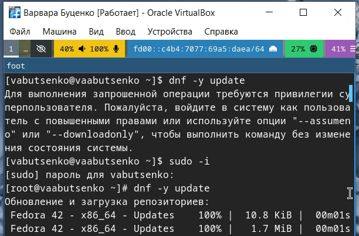
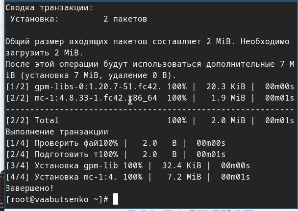
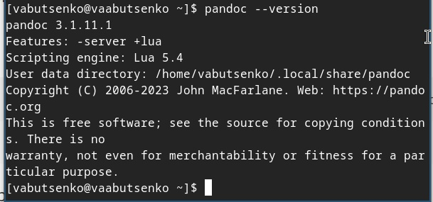
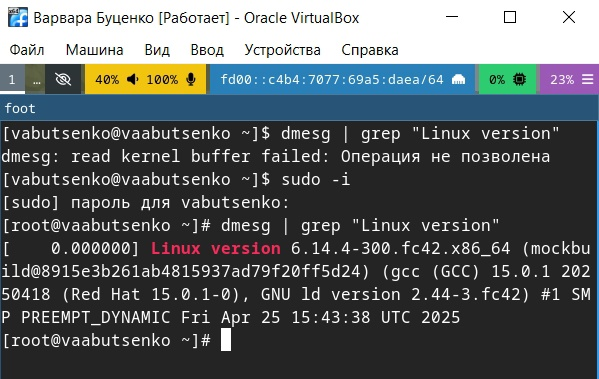
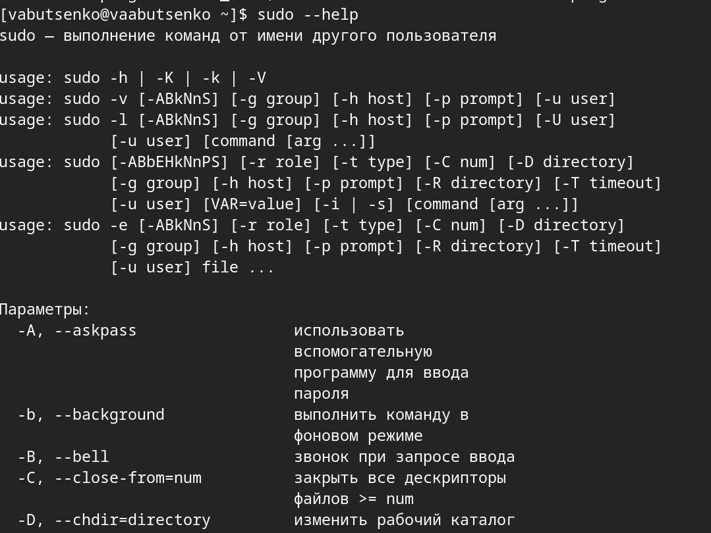
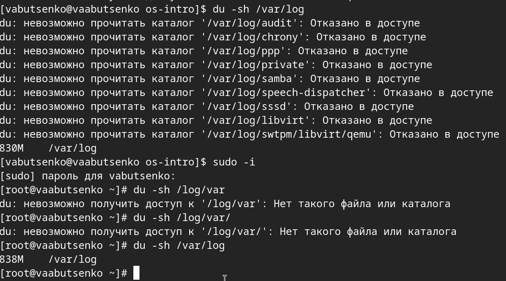
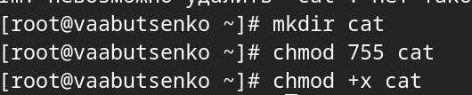
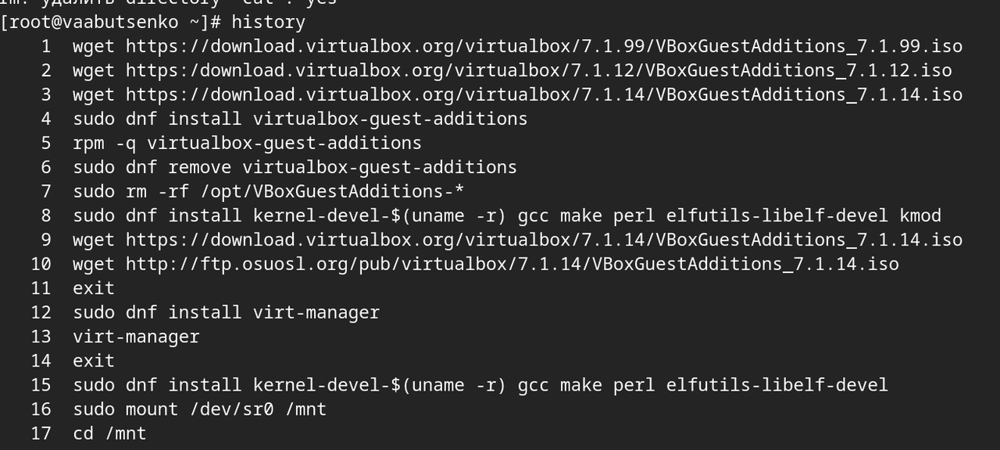

---
## Front matter
lang: ru-RU
title: Операционные системы
subtitle: Лабораторная работа №1
author:
  - Буценко В. А.
institute:
  - Российский университет дружбы народов, Москва, Россия
  - 4 курс НПМбв-02-21 
date: 12 мая 2025

## i18n babel
babel-lang: russian
babel-otherlangs: english

## Formatting pdf
toc: false
toc-title: Содержание
slide_level: 2
aspectratio: 169
section-titles: true
theme: metropolis
header-includes:
 - \metroset{progressbar=frametitle,sectionpage=progressbar,numbering=fraction}
---

# Информация

## Докладчик

:::::::::::::: {.columns align=center}
::: {.column width="70%"}

  * Буценко Варвара Алексеевна
  * студент 4 курса НПМбв-02-21
  * Российский университет дружбы народов
  * [1032200547@pfur.ru](mailto:1032200547@pfur..ru)
  * <https://github.com/vabucenko/study_2024-2025_os-intro>

:::
::: {.column width="30%"}

:::
::::::::::::::

# Вводная часть

## Выполнение лабораторной работы

1) Необходимо создать виртуальную машину.
2) Установить операционную систему Linux.
3) Установить систему на диск.
4) Переключиться на роль супер пользователя и обновить все пакеты, а такжеустановить программы для удобства работы в консоли.
5) Установить имя пользователя и название хоста.
6) Подключить общую папку.
7) Установить программное обеспечение для создания документации.
8) Установить средство pandoc для работы с языком разметки Merkdown.
9) Установить дистрибутив TexLive.
10) После создания и настройки виртуальной машины, дождаться загрузки графического окружения и открыть терминал. В окне терминала проанализировать последовательность загрузки системы, выполнив команду dmesg.

## Выполнение лабораторной работы

1) Создаю виртуальную машину и настраиваю её: устанавливаю операционную систему, устанавливаю систему на диск. После этого захожу в ОС под заданной мною при установке учётной записью (рис.1).

.jpg){ width=50% }

## Выполнение лабораторной работы

2) Переключаюсь на роль супер-пользователя (sudo -i), обновляю все пакеты (dnf -y update) 

{ width=50% }

## Выполнение лабораторной работы

3) Устанавливаю программы для удобства работы консоли (dnf -y install tmux mc)

{ width=50% }
{ width=50% }

## Выполнение лабораторной работы

4) Устанавливаю имя пользователя и название хоста. Команду я уже выполняла заранее, поэтому на скриншотах представлен вывод.

{ width=50% }

## Выполнение лабораторной работы

5) Подключаю общую папку, использую (gpasswd -a vabutsenko vboxsf), в хостовой системе подключаю разделяемую папку. 

{ width=50% }
{ width=50% }

## Выполнение лабораторной работы

6) Устанавливаю программное обеспечение для создания документации (sudo -y install pandoc). 

{ width=50% }

## Выполнение лабораторной работы

7) Установить дистрибутив TeXlive (dnf -y install texlive-scheme-full).

{ width=50% }

## Выполнение лабораторной работы

8) С помощью команды (dmesg | grep “Linux version”) я смогла получить версию ядра Linux. 

{ width=50% }

## Выполнение лабораторной работы
 
 С помощью команды (dmesg | grep “MHz processor”) смогла получить частот процессора.

{ width=50% }

## Выполнение лабораторной работы

 С помощью команды (dmesg | grep -m 1 “CPU0”) смогла получить модель процессора.

{ width=50% }

## Выполнение лабораторной работы

 С помощью команды (dmesg | grep “Memory available”) смогла получить объём доступной опертивной памяти.

{ width=50% }

## Выполнение лабораторной работы

 С помощью команды (dmesg | grep “Hypervisor detected”) смогла получить тип обнаруженного гипервизора

{ width=50% }

## Выполнение лабораторной работы

С помощью команды (dmesg | grep “mounted filesystem”) смогла получить тип файловой системы

{ width=50% }

## Выполнение лабораторной работы

С помощью команды (dmesg | grep “mount”) смогла получить последовательность монтирования.

.jpg){ width=30% } .jpg){ width=30% }

## Контрольные вопросы

1) Какую информацию содержит учётная запись пользователя?

Учётная запись пользователя содержит логин, user ID, домашний каталог, оболочку, хэш пароля, группы пользователя.

## Контрольные вопросы

2) Укажите команды терминала и приведите примеры:

- для полечения справки по команде;
- man команда 
- команда –help

{ width=50% } 

## Контрольные вопросы

- для перемещения по файловой системе;
- pwd (текущий каталог) 
- cd путь (перейти в указанный каталог)

{ width=50% } 

## Контрольные вопросы

- для просмотра содержимого каталога;
- ls (список файлов и каталогов) ls -l (подробный список) 
- ls -a (скрытые файлы)

{ width=50% } 

## Контрольные вопросы

- для определения объёма калатога;
- du -sh путь (размер каталога) 
- su -sh * (размер всех элементов в текущем каталоге)

{ width=50% } 

## Контрольные вопросы

- для создания/удаления каталогов/файлов;
- mkdir каталог (создать каталог) 
- touch файл (создать пустой файл) 
- rm файл (удалить файл) 
- rm -r каталог (удалить каталог рекурсивно)

{ width=50% } 

## Контрольные вопросы

Для задания определённых прав на файл/каталог;

- chmod файл (изменить права)
- chmod ures:group файл (изменить владельца и группу)

{ width=50% }

## Контрольные вопросы

для просмотра истории команд.
history (показать все выполненные команды)

{ width=50% } 

## Контрольные вопросы

3) Что такое файловая система? Приведите примеры с краткой характеристикой.
- Файловая система - это способ организации, хранения и управления данными на носителях. Она определяет, как файлы и каталоги структурированы, как хранятся метаданные, как обеспечить доступ к данным.
- Linux | ext4 (Four Extended Filesystem): 
- Стандарт для большинства дистрибутивов Linux 
- Поддержка журналирования (защита от сбоев) 
- Максимальный размер файла: 16 ТБ, раздела: 1ЭБ (эксабайт)

- Windows | NTFS (New Technology FIle System): 
- Поддержка прав доступа, шифрование (EFS), сжатия
- Максимальный размер файла: 256 ТБ

## Контрольные вопросы

4) Как посмотреть, какие файловые системы подмонтированы в ОС?

В Linux с помощью терминала командой mount (список всех подключённых файловых систем).

## 5) Как удалить зависший процесс?

5) Как удалить зависший процесс?

- Можно использовать сочетание клавиш ctrl + c | win + c (прерывает текущий процесс в терминале). Или приостановить процесс с помощью ctrl + z | win + z, а затем ввести команду, удаляющую процесс.
- jobs (показать приостановленные процессы) kill -9 %1 (убить процесс с номером 1)

## Выводы

- В ходе выполнения лабораторной работы были успешно выполнены все поставленные задачи, связанные с установкой и настройкой операционной системы Linux на виртуальную машину. В процессе работы были приобретены практические навыки,которые включали:
- Создание и настройку виртуальной машины, включая установку операционной системы Linux и её конфигурацию.
- Управление пакетами и обновлениями через команды dnf.
- Настройку пользовательского окружения, включая установку имени пользователя, хоста и подключение общей папки для удобного обмена данными между хостовой и гостевой системами.
- Установку инструментов для работы с документацией, таких как pandoc и TeXlive.

## Выводы

- Анализ загрузки системы с помощью команды dmesg.
- Приобретённые навыки будут полезны для дальнейшего изучения операционных систем и их практического применения.

