---
## Front matter
title: "Лабораторная работа №1"
subtitle: "Установка ОС Linux"
author: "Варвара Алексеевна Буценко"

## Generic otions
lang: ru-RU
toc-title: "Содержание"

## Bibliography
bibliography: bib/cite.bib
csl: pandoc/csl/gost-r-7-0-5-2008-numeric.csl

## Pdf output format
toc: true # Table of contents
toc-depth: 2
lof: true # List of figures
lot: true # List of tables
fontsize: 12pt
linestretch: 1.5
papersize: a4
documentclass: scrreprt
## I18n polyglossia
polyglossia-lang:
  name: russian
  options:
	- spelling=modern
	- babelshorthands=true
polyglossia-otherlangs:
  name: english
## I18n babel
babel-lang: russian
babel-otherlangs: english
## Fonts
mainfont: IBM Plex Serif
romanfont: IBM Plex Serif
sansfont: IBM Plex Sans
monofont: IBM Plex Mono
mathfont: STIX Two Math
mainfontoptions: Ligatures=Common,Ligatures=TeX,Scale=0.94
romanfontoptions: Ligatures=Common,Ligatures=TeX,Scale=0.94
sansfontoptions: Ligatures=Common,Ligatures=TeX,Scale=MatchLowercase,Scale=0.94
monofontoptions: Scale=MatchLowercase,Scale=0.94,FakeStretch=0.9
mathfontoptions:
## Biblatex
biblatex: true
biblio-style: "gost-numeric"
biblatexoptions:
    - parentracker=true
    - backend=biber
    - hyperref=auto
    - language=auto
    - autolang=other*
    - citestyle=gost-numeric
## Pandoc-crossref LaTeX customization
figureTitle: "Рис."
tableTitle: "Таблица"
listingTitle: "Листинг"
lofTitle: "Список иллюстраций"
lotTitle: "Список таблиц"
lolTitle: "Листинги"
## Misc options
indent: true
header-includes:
    - \usepackage{indentfirst}
    - \usepackage{float} # keep figures where there are in the text
    - \floatplacement{figure}{H} # keep figures where there are in the text
---

# Цель работы

Целью данной работы является приобретение практических навыков установки операционной системы на виртуальную машину, настройки минимально необходимых для дальнейшей работы сервисов.

# Задание 

1) Необходимо создать виртуальную машину.
2) Установить операционную систему Linux.
3) Установить систему на диск.
4) Переключиться на роль супер пользователя и обновить все пакеты, а также установить программы для удобства работы в консоли. 
5) Установить имя пользователя и название хоста.
6) Подключить общую папку. 
7) Установить программное обеспечение для создания документации.
8) Установить средство pandoc для работы с языком разметки Merkdown.
9) Установить дистрибутив TexLive.

10) После создания и настройки виртуальной машины, дождаться загрузки графического окружения и открыть терминал. В окне терминала проанализировать последовательность загрузки системы, выполнив команду dmesg. 

Получить следующую информацию:
Версия ядра Linux (Linux version)
Частота процессора (Detected Mhz processor)
Модель процессора (CPU0)
Объём доступной оперативной памяти (Memory available)
Тип обнаруженного гипервизора (Hypervisor detected)
Тип файловой системы корневого раздела
Последовательность монтирования файловых систем

# Теоретическое введение

Здесь описываются теоретические аспекты, связанные с выполнением работы.

Вся необходимая теория по лабораторной работе №1 находится в разделе курса "Операционные сестемы" по ссылке https://esystem.rudn.ru/mod/page/view.php?id=1103905.ru

# Выполнение лабораторной работы

Описываются проведённые действия, в качестве иллюстрации даётся ссылка на иллюстрацию (рис. [-@fig:001]).

1) Создаю виртуальную машину и настраиваю её: устанавливаю операционную систему, устанавливаю систему на диск. После этого захожу в ОС под заданной мною при установке учётной записью (рис.1).

.jpg){#fig:001 width=70%}

2) Переключаюсь на роль супер-пользователя (sudo -i), обновляю все пакеты (dnf -y update) (рис.2-6)

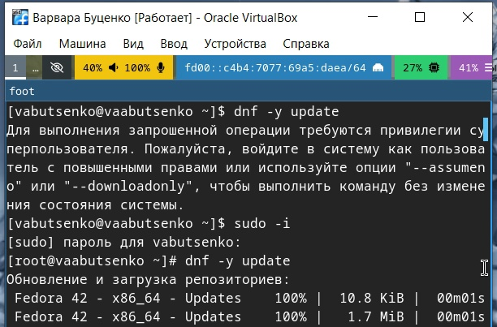{#fig:001 width=70%}

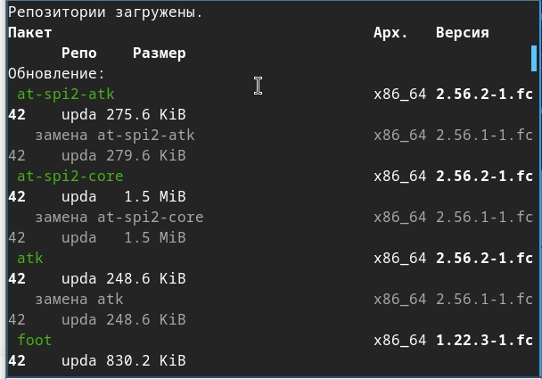{#fig:001 width=70%}

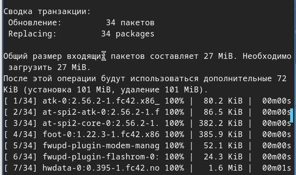{#fig:001 width=70%}

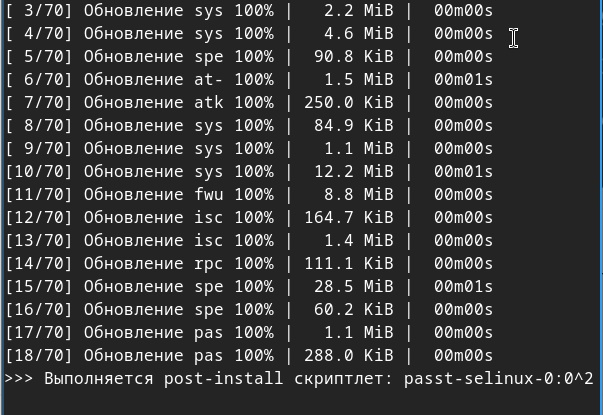{#fig:001 width=70%}

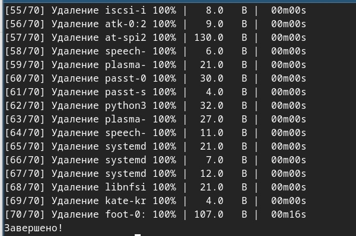{#fig:001 width=70%}

3) Устанавливаю программы для удобства работы консоли (dnf -y install tmux mc) (рис.7-8)

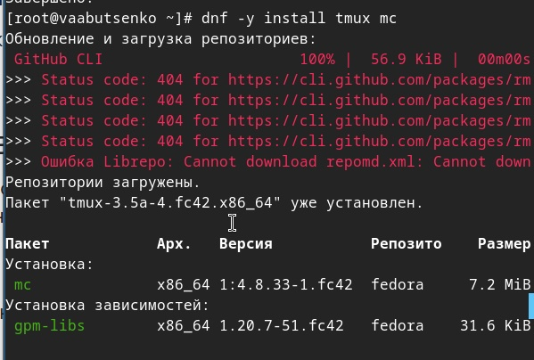{#fig:001 width=70%}

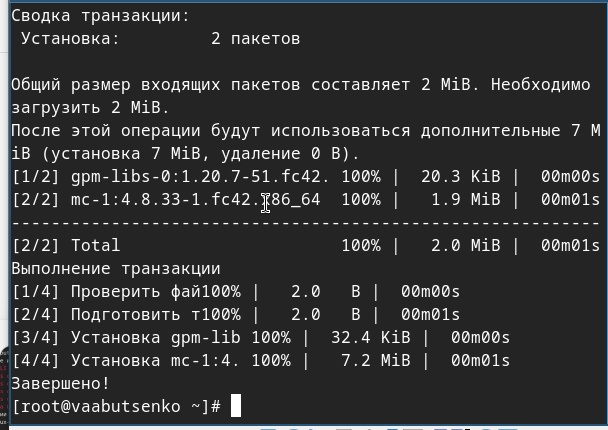{#fig:001 width=70%}

4) Устанавливаю имя пользователя и название хоста. Команду я уже выполняла заранее, поэтому на скриншотах представлен вывод. (рис.9)

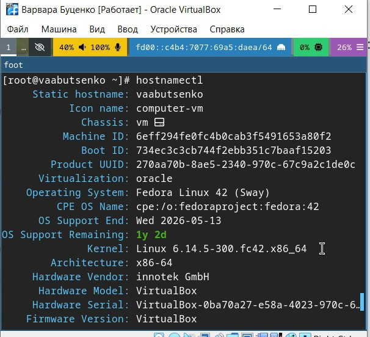{#fig:001 width=70%}

5) Подключаю общую папку, использую (gpasswd -a vabutsenko vboxsf), в хостовой системе подключаю разделяемую папку. В итоге у меня есть в родной ОС папка, связанная с ОС виртуальной машины. Я могу добавлять туда файлы и использовать их и в родной ОС, и в виртуальной. (рис.10-11)

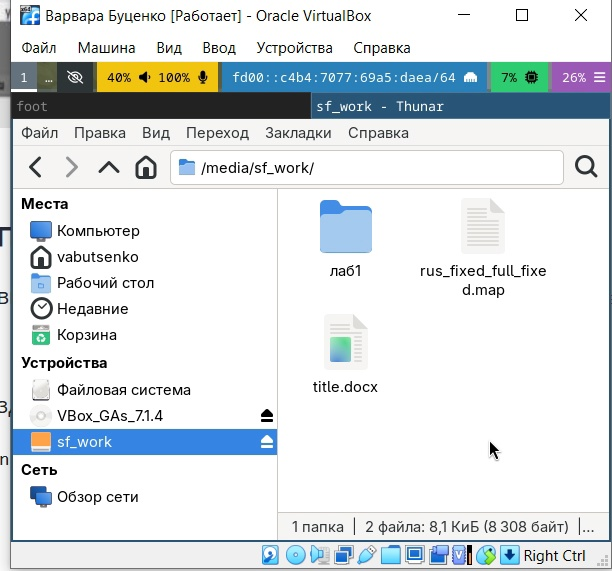{#fig:001 width=70%}

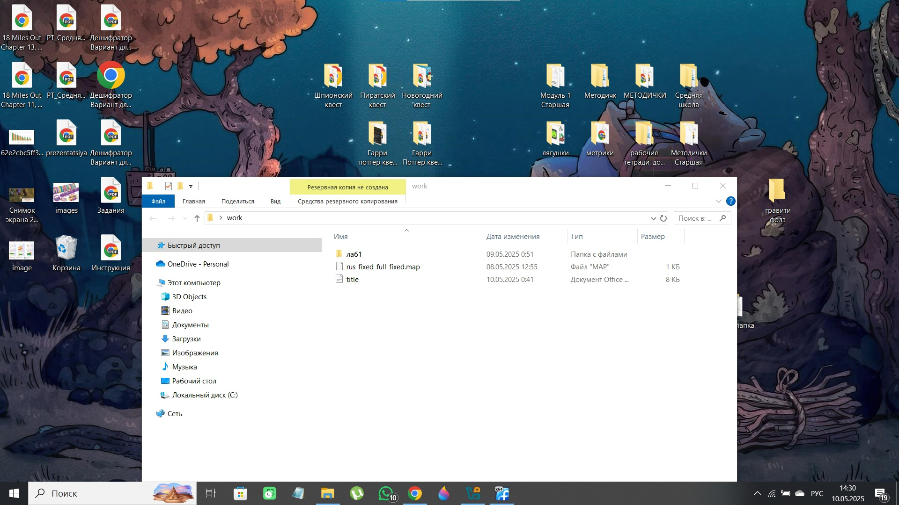{#fig:001 width=70%}

6) Устанавливаю программное обеспечение для создания документации (sudo -y install pandoc). Я заранее установила, поэтому на рисунке будет показана версия моего pandoc.(рис.12)

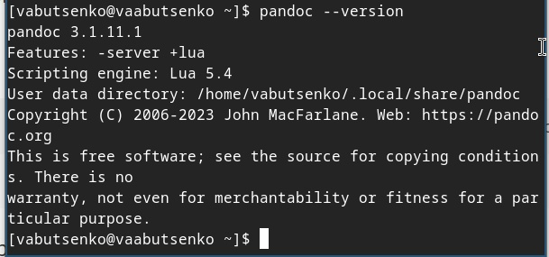{#fig:001 width=70%}

7) Установить дистрибутив TeXlive (dnf -y install texlive-scheme-full). Я заранее установила, поэтому на рисунке будет показана версия моего TeXlive. (рис.13)

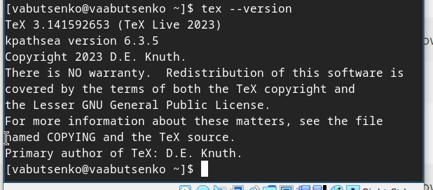{#fig:001 width=70%}

8) Необходимо проанализировать последовательность загрузки системы, выполнив команду dmesg. 

   С помощью команды (dmesg | grep "Linux version") я смогла получить версию ядра Linux. (рис.14)

{#fig:001 width=70%}

   С помощью команды (dmesg | grep "MHz processor") смогла получить частоту процессора. (рис.15)

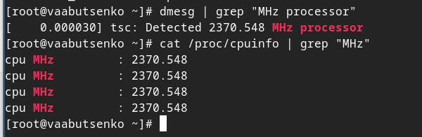{#fig:001 width=70%}

   С помощью команды (dmesg | grep -m 1 "CPU0") смогла получить модель процессора. (рис.16)

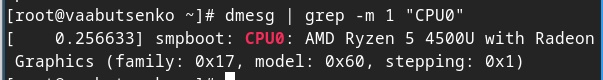{#fig:001 width=70%}

   С помощью команды (dmesg | grep "Memory available") смогла получить объём доступной опертивной памяти. (рис.17)

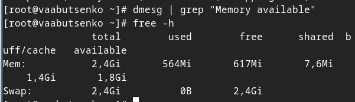{#fig:001 width=70%}

   С помощью команды (dmesg | grep "Hypervisor detected") смогла получить тип обнаруженного гипервизора. (рис.18)

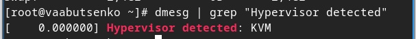{#fig:001 width=70%}

   С помощью команды (dmesg | grep "mounted filesystem") смогла получить тип файловой системы. (рис.19)

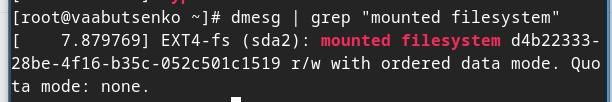{#fig:001 width=70%}

   С помощью команды (dmesg | grep "mount") смогла получить последовательность монтирования. (рис.20-21)

.jpg){#fig:001 width=70%}

.jpg){#fig:001 width=70%}

# Контрольные вопросы

1) Какую информацию содержит учётная запись пользователя?

Учётная запись пользователя содержит логин, user ID, домашний каталог, оболочку, хэш пароля, группы пользователя. 

2) Укажите команды терминала и приведите примеры:

Для полечения справки по команде;

- man команда 
- команда --help

{#fig:001 width=70%}

Для перемещения по файловой системе;

- pwd (текущий каталог)
- cd путь (перейти в указанный каталог)

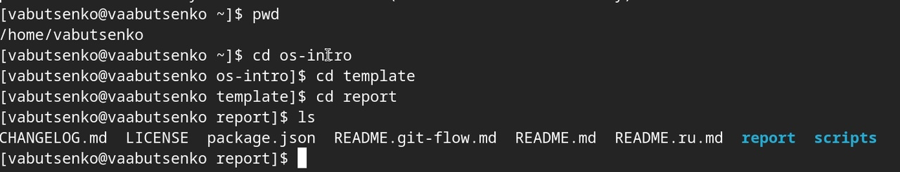{#fig:001 width=70%}

Для просмотра содержимого каталога;

- ls (список файлов и каталогов)
- ls -l (подробный список)
- ls -a (скрытые файлы)

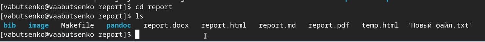{#fig:001 width=70%}

Для определения объёма калатога;

- du -sh путь (размер каталога)
- su -sh * (размер всех элементов в текущем каталоге)

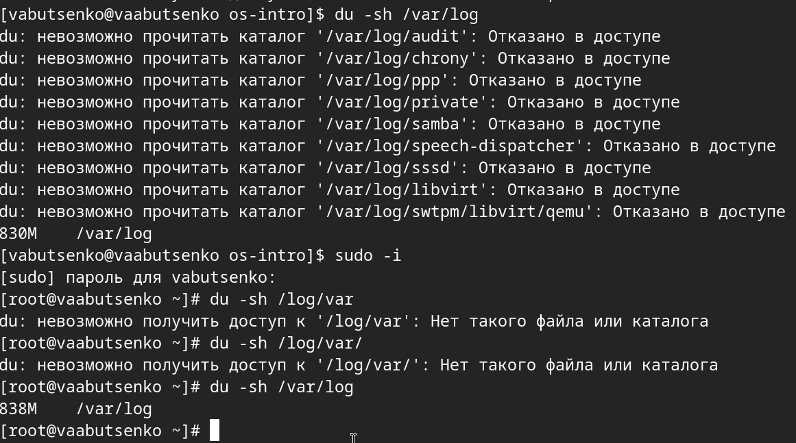{#fig:001 width=70%}

Для создания/удаления каталогов/файлов;

- mkdir каталог (создать каталог)
- touch файл (создать пустой файл)
- rm файл (удалить файл)
- rm -r каталог (удалить каталог рекурсивно)

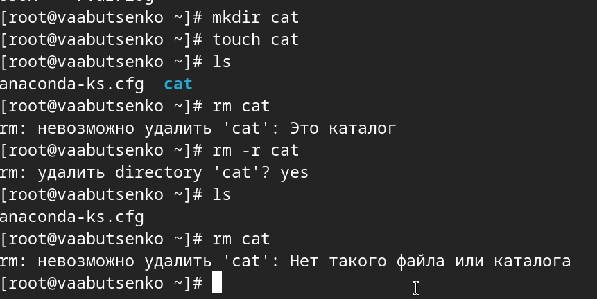{#fig:001 width=70%}

Для задания определённых прав на файл/каталог;

- chmod файл (изменить права)
- chmod ures:group файл (изменить владельца и группу)

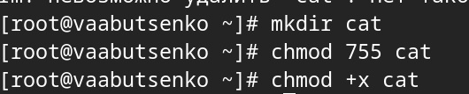{#fig:001 width=70%}

Для просмотра истории команд.

history (показать все выполненные команды)

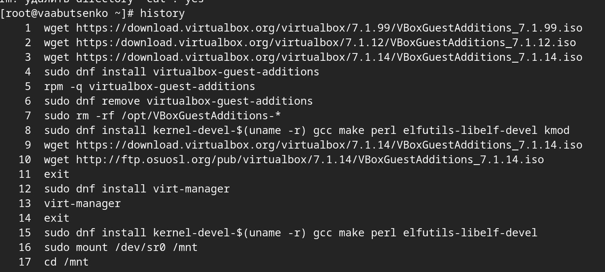{#fig:001 width=70%}

3) Что такое файловая система? Приведите примеры с краткой характеристикой.

Файловая система - это способ организации, хранения и управления данными на носителях. Она определяет, как файлы и каталоги структурированы, как хранятся метаданные, как обеспечить доступ к данным.

- Linux | ext4 (Four Extended Filesystem):
- Стандарт для большинства дистрибутивов Linux
- Поддержка журналирования (защита от сбоев)
- Максимальный размер файла: 16 ТБ, раздела: 1ЭБ (эксабайт)

- Windows | NTFS (New Technology FIle System):
- Поддержка прав доступа, шифрование (EFS), сжатия
- Максимальный размер файла: 256 ТБ 

4) Как посмотреть, какие файловые системы подмонтированы в ОС?

В Linux с помощью терминала командой mount (список всех подключённых файловых систем).

5) Как удалить зависший процесс?

Можно использовать сочетание клавиш ctrl + c | win + c (прерывает текущий процесс в терминале). Или приостановить процесс с помощью ctrl + z | win + z, а затем ввести команду, удаляющую процесс.

- jobs (показать приостановленные процессы)
- kill -9 %1 (убить процесс с номером 1)

# Выводы

- В ходе выполнения лабораторной работы были успешно выполнены все поставленные задачи, связанные с установкой и настройкой операционной системы Linux на виртуальную машину. В процессе работы были приобретены практические навыки, которые включали:

- Создание и настройку виртуальной машины, включая установку операционной системы Linux и её конфигурацию.
- Управление пакетами и обновлениями через команды dnf, что позволило обеспечить актуальность и безопасность системы.
- Настройку пользовательского окружения, включая установку имени пользователя, хоста и подключение общей папки для удобного обмена данными между хостовой и гостевой системами.
- Установку инструментов для работы с документацией, таких как pandoc и TeXlive, что необходимо для создания профессиональных отчётов и презентаций.
- Анализ загрузки системы с помощью команды dmesg, что позволило получить ключевую информацию о системе, включая версию ядра, параметры процессора, объём оперативной памяти и тип файловой системы.

- Приобретённые навыки будут полезны для дальнейшего изучения операционных систем и их практического применения.

# Список литературы{.unnumbered}

1. Dash, P. Getting Started with Oracle VM VirtualBox / P. Dash. – Packt Publishing Ltd, 2013. –
86 сс.
2. Colvin, H. VirtualBox: An Ultimate Guide Book on Virtualization with VirtualBox. VirtualBox /
H. Colvin. – CreateSpace Independent Publishing Platform, 2015. – 70 сс.
3. Vugt, S. van. Red Hat RHCSA/RHCE 7 cert guide : Red Hat Enterprise Linux 7 (EX200 and
EX300) : Certification Guide. Red Hat RHCSA/RHCE 7 cert guide / S. van Vugt. – Pearson IT
Certification, 2016. – 1008 сс.
4. Робачевский, А. Операционная система UNIX / А. Робачевский, С. Немнюгин, О. Стесик.
– 2-е изд. – Санкт-Петербург : БХВ-Петербург, 2010. – 656 сс.
5. Немет, Э. Unix и Linux: руководство системного администратора. Unix и Linux / Э. Немет,
Г. Снайдер, Т.Р. Хейн, Б. Уэйли. – 4-е изд. – Вильямс, 2014. – 1312 сс.
6. Колисниченко, Д.Н. Самоучитель системного администратора Linux : Системный
администратор / Д.Н. Колисниченко. – Санкт-Петербург : БХВ-Петербург, 2011. – 544 сс.
7. Robbins, A. Bash Pocket Reference / A. Robbins. – O’Reilly Media, 2016. – 156 сс.

