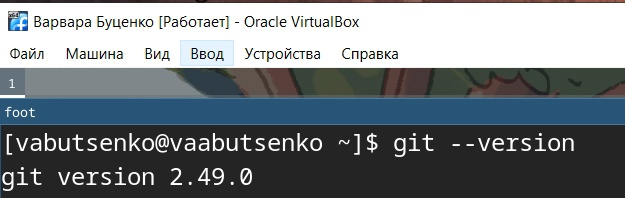
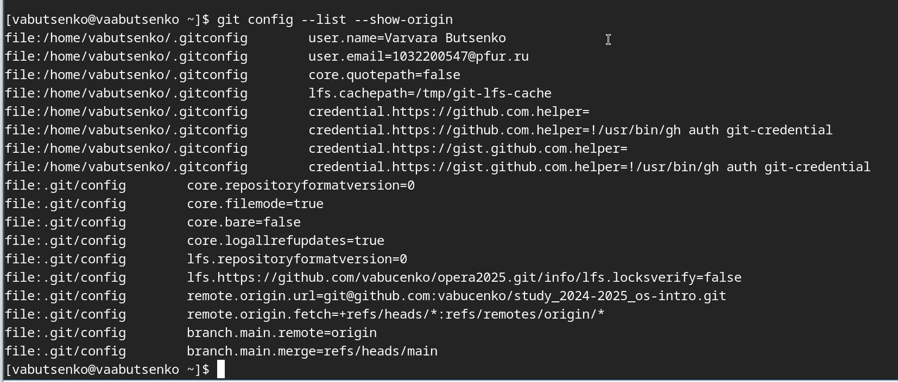
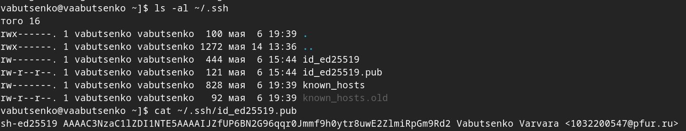
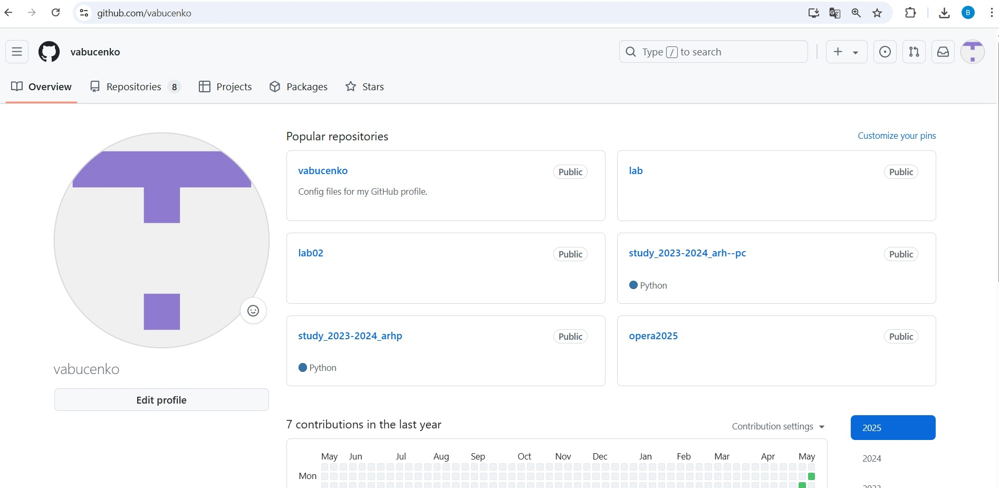
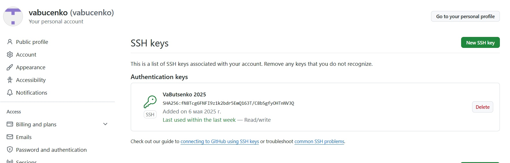
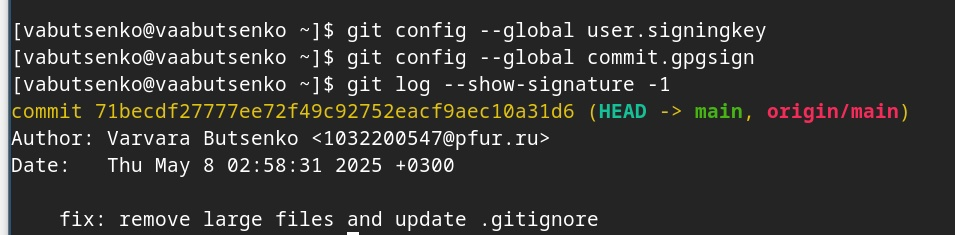
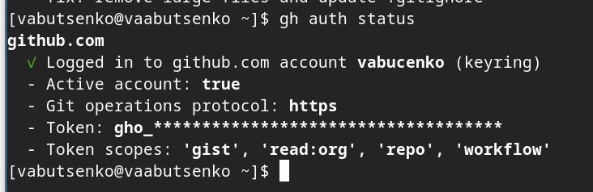
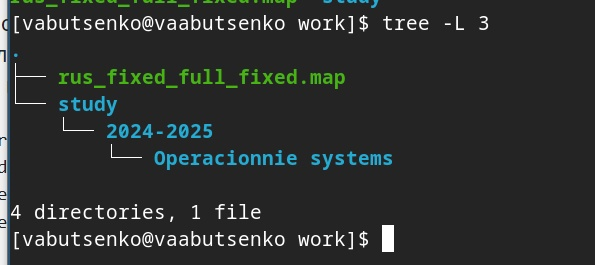
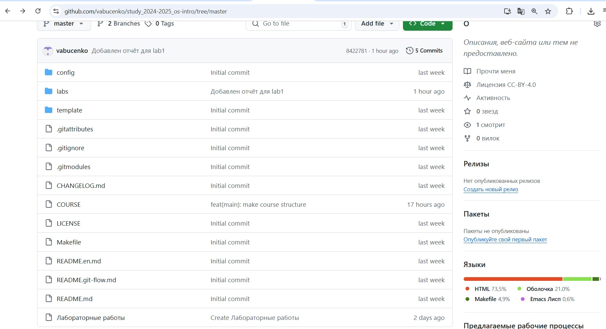
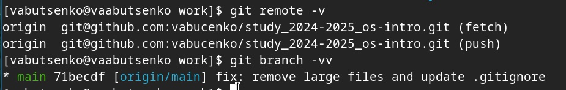

---
## Front matter
lang: ru-RU
title: Операционные системы
subtitle: Лабораторная работа №2
author:
  - Буценко В. А.
institute:
  - Российский университет дружбы народов, Москва, Россия
  - 4 курс НПМбв-02-21 
date: 12 мая 2025

## i18n babel
babel-lang: russian
babel-otherlangs: english

## Formatting pdf
toc: false
toc-title: Содержание
slide_level: 2
aspectratio: 169
section-titles: true
theme: metropolis
header-includes:
 - \metroset{progressbar=frametitle,sectionpage=progressbar,numbering=fraction}
---

# Информация

## Докладчик

:::::::::::::: {.columns align=center}
::: {.column width="70%"}

  * Буценко Варвара Алексеевна
  * студент 4 курса НПМбв-02-21
  * Российский университет дружбы народов
  * [1032200547@pfur.ru](mailto:1032200547@pfur..ru)
  * <https://github.com/vabucenko/study_2024-2025_os-intro>

:::
::: {.column width="30%"}

:::
::::::::::::::

# Вводная часть

## Задание

1) Создать базовую конфигурацию для работы с git.
2) Создать ключ SSH.
3) Создать ключ PGP.
4) Настроить подписи git.
5) Зарегистрироваться на Github.
6) Создать локальный каталог для выполнения заданий по предмету.

## Выполнение лабораторной работы 1

1)​ Устанавливаю git. Заранее сделала это, поэтому использую командуgit --version, чтобы показать свою версию.

{ width=50% }

## Выполнение лабораторной работы 2

2)​ Устанавливаю gh. Заранее сделала это, поэтому использую команду gh --version, чтобы показать свою версию.

.jpg){ width=50% }

## Выполнение лабораторной работы 3

3)​ Настраиваю git: задаю имя и email владельца:
- git config --global user.name "Name Surname",
- git config --global user.email "work@mail".

- Настраиваю utf-8 в выводе сообщений git:​
- git config --global core.quotepath false

- Настраиваю верификацию и подписание коммитов git.

- Задаю имя начальной ветки (буду называть её master):​
- git config --global init.defaultBranch master

- Параметр autocrlf:​
- git config --global core.autocrlf input

## Выполнение лабораторной работы 3

- Параметр safecrlf:​
- git config --global core.safecrlf warn
- С помощью команды git config --list --show-origin проверяю базовые настройки git.

{ width=50% }

## Выполнение лабораторной работы 4

4) Создаю ключ ssh по алгоритму rsa с ключём размером 4096 бит:​
- ssh-keygen -t rsa -b 4096
- Создаю ключ ssh по алгоритму ed25519:​
- ssh-keygen -t ed25519
- Проверяю созданные SSH-ключи:
- ls -al ~/.ssh
- cat ~/.ssh/id_ed25519.pub

{ width=50% }

## Выполнение лабораторной работы 5

5) Генерирую ключ pgp​
- gpg --full-generate-keyИз предложенных опций выбираю:
- тип RSA and RSA;
- размер 4096;
- выбераю срок действия; значение по умолчанию — 0 (срок действия не истекает никогда).
- GPG запросит личную информацию, которая сохранится в ключе:
- Имя: vabucenko
- Адрес электронной почты: 1032200547@pfur.ru

{ width=50% }

## Выполнение лабораторной работы 6

6) Настраиваю github. В прошлом году при прохождении курса “архитектура компьютера” я уже создавала учётную запись, так что использую для выполнения задания именно её.

{ width=50% }

## Выполнение лабораторной работы 7

7) Добавляю PGP ключ в GitHub
- Вывожу список ключей и копирую отпечаток приватного ключа:​
- gpg --list-secret-keys --keyid-format LONG
- Перехожу в настройки GitHub (https://github.com/settings/keys), нажмаю на кнопку New GPG key и вставляю полученный ключ в поле ввода.

{ width=50% } { width=50% }

## Выполнение лабораторной работы 8

8) Проверяю подписи коммитов
- git config --global user.signingkey
- git config --global commit.gpgsign
- git log --show-signature -1

{ width=50% }

## Выполнение лабораторной работы 9

9) Проверяю аутентификации в GitHub CLI
- gh auth status
- Создаю шаблон рабочего пространства.
- mkdir -p ~/work/study/2024-2025/"Operacionnie systems"
- cd ~/work/study/2024-2025/"Operacionnie systems
- gh repo create study_2024-2025_os-intro
- --template=yamadharma/course-directory-student-template --publicgit clone --recursive git@github.com:<owner>/study_2024-2025_os-intro.git os-intro

## Выполнение лабораторной работы 9
 
- Перехожу в каталог курса:​
- cd ~/work/study/2024-2025/"Operacionnie systems"/os-intro

- Удаляю лишние файлы:​
- rm package.json

- Создаю необходимые каталоги:​
- echo os-intro > COURSE
- make

## Выполнение лабораторной работы 9

- Отправляю файлы на сервер:​
- git add .
- git commit -am 'feat(main): make course structure'
- git push

{ width=50% }

## Выполнение лабораторной работы 9

{ width=50% }{ width=50% }

## Выполнение лабораторной работы 9

{ width=50% }

## Контрольные вопросы 1

1) Что такое системы контроля версий (VCS) и для решения каких задач
они предназначаются?

Системы контроля версий (VCS) — это программные инструменты для отслеживания изменений в файлах (чаще всего в исходном коде) и координации работы нескольких участников. Они позволяют фиксировать историю изменений, возвращаться к предыдущим версиям и совместно работать над проектами.

Для решения каких задач предназначаются: ​
- Хранение истории изменений​
- Командная разработка​
- Резервное копирование
- Анализ изменений

## Контрольные вопросы 2

2) Объясните следующие понятия VCS и их отношения: хранилище, commit, история, рабочая копия.

- Хранилище - база данных, хранящая всю историю проекта (файлы, изменения, авторов).
- Коммит - снимок состояния файлов на определённый момент времени.
- История - цепочка коммитов, отражающая эволюцию проекта.
- Рабочая копия - текущие файлы в вашей папке проекта, с которыми вы работаете.

## Контрольные вопросы 3

3) Что представляют собой и чем отличаются централизованные и децентрализованные VCS? Приведите примеры VCS каждого вида.

- Ключевое различие — в способе хранения истории изменений и организации работы.

- Централизованные это системы, где вся история проекта хранится на едином сервере. Разработчики получают из него последние версии файлов и отправляют изменения обратно.

- Децентрализованные - это системы, где каждый участник проекта имеет полную копию репозитория со всей историей изменений. Работа ведётся локально, а синхронизация между копиями происходит через команды push/pull.

## Контрольные вопросы 3

Централизованные:
- SVN
- CVS
- Perforce

Децентрализованные:
- Git
- Mercurial
- Bazaar
 
## Контрольные вопросы 4

4) Опишите действия с VCS при единоличной работе с хранилищем.

- Инициализация репозитория
- Ежедневные действияa (проверить изменения, добавить файлы в индекс, зафиксировать изменения)
- Просмотр истории
- Работа с ветками
- Синхронизация с удалённым репозиторием
- Отмена изменений (при ошибках)

## Контрольные вопросы 5

5) Опишите порядок работы с общим хранилищем VCS.

- Клонирование репозитория
- Создание своей ветки
- Ежедневная работа (внесение изменений в файлы, регулярное сохранение изменений (коммиты))
- Синхронизация с общим репозиторием
- Создание Pull/Merge Request
- Рецензирование и исправления
- Слияние изменений
- Удаление отработанной ветки

## Контрольные вопросы 6 

6) Каковы основные задачи, решаемые инструментальным средством git?

- Контроль версий
- Командная разработка
- Ветвление и слияние
- Резервное копирование
- Отслеживание изменений
- Тестирование идей
- Автоматизация процессов
- Распределённая разработка

## Контрольные вопросы 7 

7)​ Назовите и дайте краткую характеристику командам git.

- Настройка: 
- git config Настройка параметров Git (имя пользователя, email,
редактор и др.).
- git config --global user.name "Ваше Имя"
Создание и клонирование репозиториев
- git init Создает новый локальный репозиторий в текущей папке.
- git clone <url> Клонирует удаленный репозиторий на локальную
машину.

- Работа с изменениями:
- git status Показывает состояние файлов (измененные, добавленные,
неотслеживаемые).
- git add <файл> Добавляет файлы в индекс (staging area) для
последующего коммита.
- git commit -m "сообщение" Фиксирует изменения в репозитории с
комментарием.
- git restore <файл> Отменяет изменения в файле (до последнего
коммита).

## Контрольные вопросы 7 

- Просмотр истории:
- git log Выводит историю коммитов (автор, дата, сообщение).
- git diff Показывает разницу между текущими изменениями и
последним коммитом.Ветвление и слияние
- git branch Показывает список веток (текущая помечена *).
- git checkout <ветка> Переключается на указанную ветку.
- git merge <ветка> Вливает изменения из указанной ветки в текущую.

- Работа с удаленными репозиториями
- git remote add <имя> <url> Добавляет удаленный репозиторий
(например, origin).
- git push <remote> <ветка> Отправляет локальные изменения на
удаленный сервер.
- git pull <remote> <ветка> Забирает изменения с удаленного
репозитория и сливает с локальным.

## Контрольные вопросы 7 

- Отмена изменений:
- git reset --hard HEAD Сбрасывает все изменения до последнего
коммита (осторожно!).
- git revert <commit> Создает новый коммит, отменяющий указанный.

## Контрольные вопросы 8 

8) Приведите примеры использования при работе с локальным и удалённым репозиториями.

- Работа с локальными репозиториями
- Создание локального репозитория: git init my_project
- Клонирование удалённого репозитория в локальный: git clone https://github.com/username/repo.git
- Добавление файлов в локальный репозиторий: git add filename.txt
- Коммит изменений в локальном репозитории: git commit -m "Добавлен новый файл"
- Просмотр статуса локального репозитория:git status

- Работа с удалёнными репозиториями
- Добавление удалённого репозитория в локальный (если он уже
существует): git remote add origin https://github.com/username/repo.git
- Получение (пулл) изменений из удалённого репозитория: git pull origin main
- Отправка (пуш) локальных изменений в удалённый репозиторий: git push origin main
- Просмотр списка подключённых удалённых репозиториев: git remote -v
- Удаление удалённого репозитория: git remote remove origin

## Контрольные вопросы 9 

9) Что такое и зачем могут быть нужны ветви (branches)?

- Ветвь — это независимая линия разработки, позволяющая изолировать изменения от основного кода (обычно main/master). Каждая ветка содержит свою историю коммитов.

- Зачем нужны ветки?
- Параллельная разработка
- Изоляция экспериментов
- Гибкое управление версиями
- Контроль качества
- Упрощение Code Review

## Контрольные вопросы 10

10)​Как и зачем можно игнорировать некоторые файлы при commit?

- Чтобы игнорировать файлы в Git, используется файл .gitignore, который находится в корневой директории репозитория. Этот файл содержит шаблоны,которые указывают, какие файлы или директории должны быть проигнорированы.

- Зачем игнорировать файлы?
- Не коммитить временные/системные файлы
Логи, кэш, бинарники (например, .log, .tmp, .exe).
- Избегать личных настроек
Файлы IDE (.idea/, .vscode/), конфиги с паролями.
- Снижать «шум» в репозитории
Автогенерируемые файлы (node_modules/, __pycache__/).

## Выводы

- В ходе выполнения лабораторной работы были успешно выполнены все поставленные задачи, связанные с изучением идеологии и применением средств контроля версий, а также освоением навыков работы с системой Git. В процессе работы были достигнуты следующие результаты:

1) Настройка базовой конфигурации Git: Были выполнены основные настройки Git, включая указание имени пользователя, email, настройку кодировки UTF-8, а также параметров для работы с ветками и окончаниями строк. Это обеспечило корректную работу системы контроля версий.

2) Создание и настройка SSH и PGP ключей: Были сгенерированы ключи SSH (алгоритмы RSA и ed25519) и PGP, что позволило обеспечить безопасное
взаимодействие с удалёнными репозиториями и подписывание коммитов.Ключи были успешно добавлены в аккаунт GitHub.

## Выводы

3) Работа с GitHub: Была выполнена аутентификация в GitHub CLI, создан шаблон рабочего пространства, а также организована структура каталога
для выполнения заданий. Локальные изменения были зафиксированы и отправлены на удалённый репозиторий.

5) Освоение команд Git: В процессе работы были изучены и применены основные команды Git, такие как git init, git clone, git add, git commit,
git push, git pull, а также команды для работы с ветками и историей изменений. Это позволило эффективно управлять версиями проекта.
