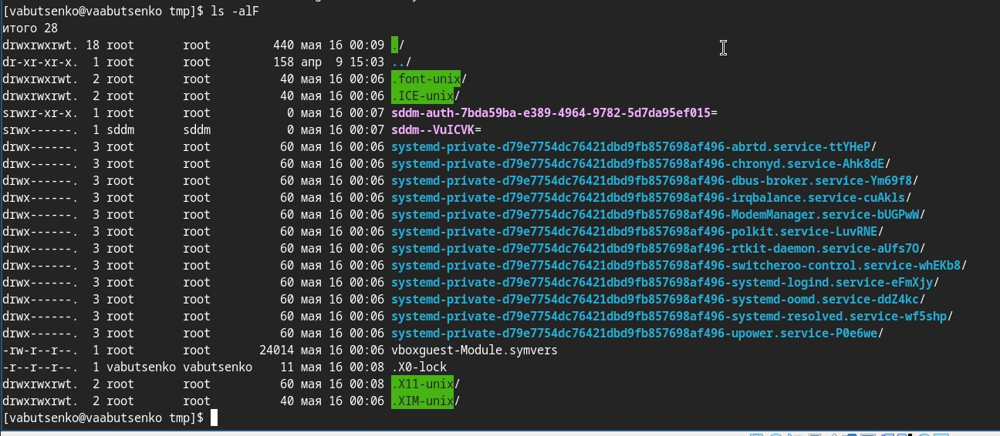
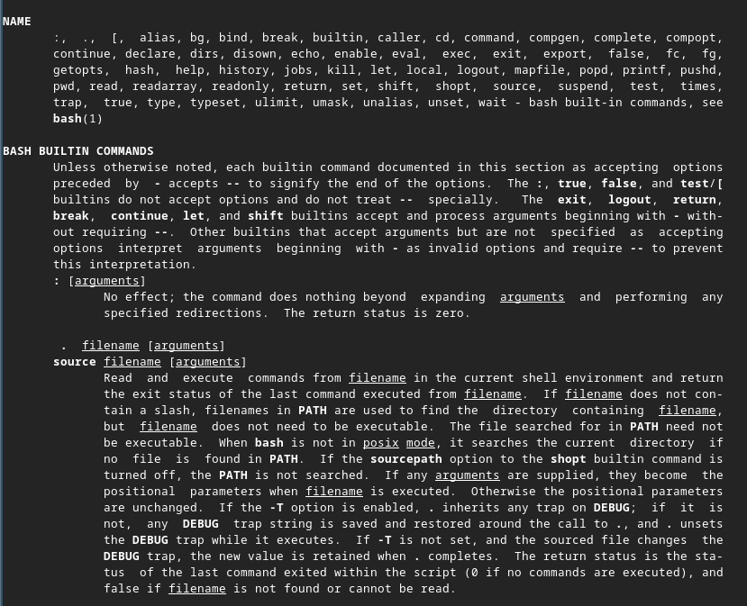
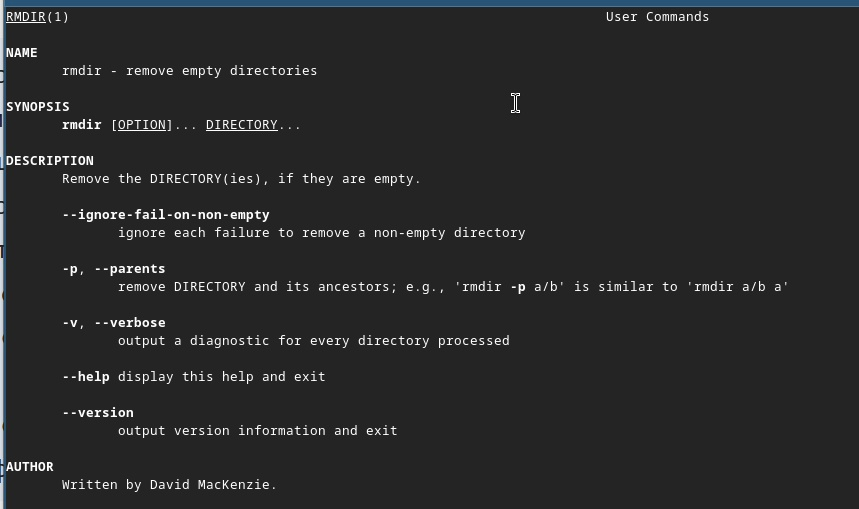
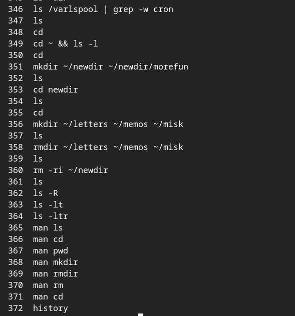
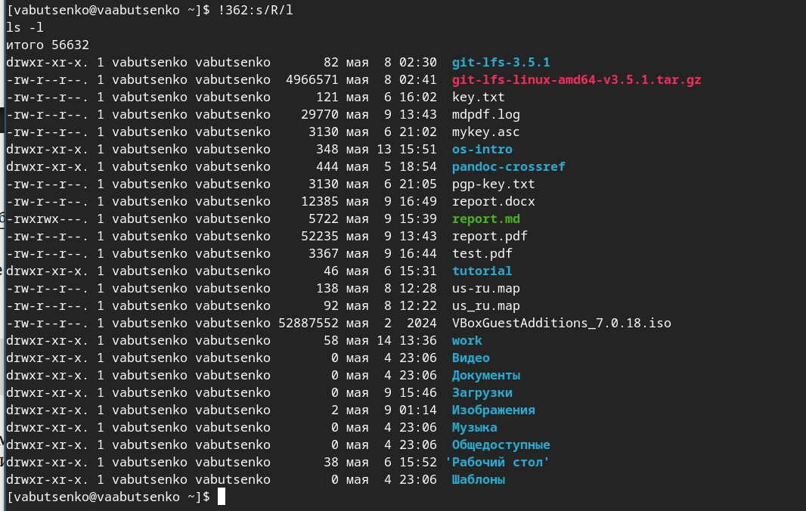

---
## Front matter
lang: ru-RU
title: Операционные системы
subtitle: Лабораторная работа №4
author:
  - Буценко В. А.
institute:
  - Российский университет дружбы народов, Москва, Россия
  - 4 курс НПМбв-02-21 
date: 16 мая 2025

## i18n babel
babel-lang: russian
babel-otherlangs: english

## Formatting pdf
toc: false
toc-title: Содержание
slide_level: 2
aspectratio: 169
section-titles: true
theme: metropolis
header-includes:
 - \metroset{progressbar=frametitle,sectionpage=progressbar,numbering=fraction}
---

# Информация

## Докладчик

:::::::::::::: {.columns align=center}
::: {.column width="70%"}

  * Буценко Варвара Алексеевна
  * студент 4 курса НПМбв-02-21
  * Российский университет дружбы народов
  * [1032200547@pfur.ru](mailto:1032200547@pfur..ru)
  * <https://github.com/vabucenko/study_2024-2025_os-intro>

:::
::: {.column width="30%"}

:::
::::::::::::::

# Вводная часть

## Задание

1) Определите полное имя вашего домашнего каталога. Далее относительно
этого каталога будут выполняться последующие упражнения.

2) Выполните следующие действия:
- 2.1. Перейдите в каталог /tmp.
- 2.2. Выведите на экран содержимое каталога /tmp. Для этого используйте команду ls с различными опциями. Поясните разницу в выводимой на экран информации.
- 2.3. Определите, есть ли в каталоге /var/spool подкаталог с именем cron?
- 2.4. Перейдите в Ваш домашний каталог и выведите на экран его содержимое. Определите, кто является владельцем файлов и подкаталогов?

## Задание

3) Выполните следующие действия:
- 3.1. В домашнем каталоге создайте новый каталог с именем newdir.
- 3.2. В каталоге ~/newdir создайте новый каталог с именем morefun.
- 3.3. В домашнем каталоге создайте одной командой три новых каталога с именами letters, memos, misk. Затем удалите эти каталоги одной командой.
- 3.4. Попробуйте удалить ранее созданный каталог ~/newdir командой rm. Проверьте, был ли каталог удалён.
- 3.5. Удалите каталог ~/newdir/morefun из домашнего каталога. Проверьте, был ли каталог удалён.

## Задание

4) С помощью команды man определите, какую опцию команды ls нужно использовать для просмотра содержимое не только указанного каталога, но
6и подкаталогов, входящих в него.
5) С помощью команды man определите набор опций команды ls, позволяю-
щий отсортировать по времени последнего изменения выводимый список
содержимого каталога с развёрнутым описанием файлов.
6) Используйте команду man для просмотра описания следующих команд: cd,
pwd, mkdir, rmdir, rm. Поясните основные опции этих команд.
7) Используя информацию, полученную при помощи команды history, выпол-
ните модификацию и исполнение нескольких команд из буфера обмена.

## Выполнение лабораторной работы 1

1) Определила полное имя моего домашнего каталога. 

/home/vabutsenko

{ width=50% }

2) Выполнила следующие действия:

2.1. Перешла в каталог /tmp.

{ width=50% }

## Выполнение лабораторной работы 

2.2. Вывела на экран содержимое каталога /tmp. Для этого использовала команду ls с различными опциями. Разница в выводимой на экран информации:

ls | что показывает:
- Только имена файлов и подкаталогов.
- Без скрытых файлов (начинающихся с точки).
- Нет дополнительных деталей (размер, владелец, дата).

{ width=50% }

## Выполнение лабораторной работы 

ls -l | что показывает:
- Права доступа (например, -rw-r--r--).
- Количество ссылок.
- Владелец (user) и группа (group).
- Размер (в байтах).
- Дата последнего изменения.
- Тип файла (d для каталога, - для обычного файла).

{ width=50% }

## Выполнение лабораторной работы 

ls -a | что показывает:
- Все файлы, включая скрытые (начинающиеся с точки, например, .hidden).
- Специальные каталоги . (текущий каталог) и .. (родительский каталог).
- Нет деталей (размер, владелец).

{ width=50% }

## Выполнение лабораторной работы 

ls -alF | что показывает:
- Все файлы (включая скрытые).
- Детали (права, владелец, размер, дата).
- Типы файлов

{ width=50% }

## Выполнение лабораторной работы 

2.3. Определила, есть ли в каталоге /var/spool подкаталог с именем cron. 

- В каталоге /var/spool нет подкаталога с именем cron.

{ width=50% }

## Выполнение лабораторной работы 

2.4. Перешла в мой домашний каталог и вывела на экран его содержимое.
Определила, кто является владельцем файлов и подкаталогов.

- Владельцем файлов и подкаталогов является vabutsenko

{ width=50% }

## Выполнение лабораторной работы 

3) Выполнила следующие действия:

3.1. В домашнем каталоге создала новый каталог с именем newdir.

{ width=50% }

## Выполнение лабораторной работы 

3.2. В каталоге ~/newdir создала новый каталог с именем morefun.

{ width=50% }

## Выполнение лабораторной работы 

3.3. В домашнем каталоге создала одной командой три новых каталога с именами letters, memos, misk. Затем удалила эти каталоги одной командой.

{ width=50% }

## Выполнение лабораторной работы 

3.4. Попробовала удалить ранее созданный каталог ~/newdir командой rm. Проверила, был ли каталог удалён.

{ width=50% }

## Выполнение лабораторной работы 

3.5. Удалила каталог ~/newdir/morefun из домашнего каталога. Проверила, был ли каталог удалён.

{ width=50% }

## Выполнение лабораторной работы 

4) С помощью команды man определила, какую опцию команды ls нужно использовать для просмотра содержимое не только указанного каталога, но и подкаталогов, входящих в него.

{ width=50% }

## Выполнение лабораторной работы 

5) С помощью команды man определила набор опций команды ls, позволяющий отсортировать по времени последнего изменения выводимый список содержимого каталога с развёрнутым описанием файлов.

{ width=50% }

## Выполнение лабораторной работы 

6) Использовала команду man для просмотра описания следующих команд: cd, pwd, mkdir, rmdir, rm. Основные опции этих команд.

1. Команда cd (Change Directory). Назначение: Перемещение между каталогами.
2. Команда pwd (Print Working Directory). Назначение: Вывод абсолютного пути текущего каталога.
3. Команда mkdir (Make Directory). Назначение: Создание каталогов.
4. Команда rmdir (Remove Directory). Назначение: Удаление пустых каталогов.
5. Команда rm (Remove). Назначение: Удаление файлов и каталогов (рекурсивно).

## Выполнение лабораторной работы 

{ width=50% }

## Выполнение лабораторной работы 

{ width=50% }

## Выполнение лабораторной работы 

{ width=50% }

## Выполнение лабораторной работы 

{ width=50% }

## Выполнение лабораторной работы 

{ width=50% }

## Выполнение лабораторной работы 

7) Используя информацию, полученную при помощи команды history, выполнила модификацию и исполнение нескольких команд из буфера обмена.

{ width=50% }

## Выполнение лабораторной работы 

{ width=50% }

{ width=50% }

## Выполнение лабораторной работы 

{ width=70% }

## Контрольные вопросы 1

1) Что такое командная строка?

- Командная строка (терминал, shell) — это текстовый интерфейс для взаимодействия с операционной системой, где пользователь вводит команды, а система выполняет их и выводит результат.

2) При помощи какой команды можно определить абсолютный путь текущего каталога? Приведите пример.

- Можно определить абсолютный путь текущего каталога командой (pwd).

## Контрольные вопросы 

3) При помощи какой команды и каких опций можно определить только тип файлов и их имена в текущем каталоге? Приведите примеры.

- Можно определить только тип файлов и их имена в текущем каталоге c помощью команды (ls -F)

4) Каким образом отобразить информацию о скрытых файлах? Приведите примеры.

- Можно отобразить информацию о скрытых файлах (ls -a)

## Контрольные вопросы 

5) При помощи каких команд можно удалить файл и каталог? Можно ли это сделать одной и той же командой? Приведите примеры.

- Можно удалить файл командой (rm file.txt), каталог (rmdir dirname).
- Да, можно удалить одной и той же командой (rm -r dirname)

6) Каким образом можно вывести информацию о последних выполненных пользователем командах? работы?

- Можно использовать команду (history)

## Контрольные вопросы 

7) Как воспользоваться историей команд для их модифицированного выполнения? Приведите примеры.

- Можно модифицировать команду из выведенного на экран списка при помощи следующей конструкции: 
- !<номер_команды>:s/<что_меняем>/<на_что_меняем>

- Пример:

- history
- 1 pwd
- 2 ls
- 3 ls -a
- !3:s/a/F
- ls -F

## Контрольные вопросы 

8) Приведите примеры запуска нескольких команд в одной строке.

- Через ; (выполнятся все, даже если предыдущая с ошибкой): ls; pwd; date
- Через && (вторая выполнится только при успехе первой): mkdir test && cd test
- Через | (передача вывода): ls -l | grep ".txt"

## Контрольные вопросы 

9) Дайте определение и приведите примера символов экранирования.

- Символы экранирования - специальные символы, которые позволяют использовать служебные символы (например, пробелы, $) как обычный текст.​

- Примеры:

- Экранирование \: echo "Цена: \$100" (Выведет: Цена: $100)

- Кавычки:
- echo 'Переменная $PATH не раскроется'
- echo "Текущий путь: $PWD"

## Контрольные вопросы 

10) Охарактеризуйте вывод информации на экран после выполнения команды ls с опцией l.

- -rw-r--r-- 1 user group 1024 May 10 10:00 file.txt

- -rw-r--r-- — права доступа,
- 1 — количество жёстких ссылок,
- user:group — владелец и группа,
- 1024 — размер в байтах,
- May 10 10:00 — дата изменения.

## Контрольные вопросы 

11) Что такое относительный путь к файлу? Приведите примеры использования относительного и абсолютного пути при выполнении какой-либо команды.

- Относительный путь к файлу - путь от текущего каталога (без / в начале).​

- Примеры: 

- Абсолютный: cat /home/user/file.txt
- Относительный (если текущий каталог /home/user): cat file.txt

## Контрольные вопросы 

12) Как получить информацию об интересующей вас команде?

- Справка: man ls
- Краткая помощь: ls --help
- Описание: whatis ls

## Контрольные вопросы 

13) Какая клавиша или комбинация клавиш служит для автоматического дополнения вводимых команд?

- Клавиша: Tab

## Выводы

В ходе выполнения лабораторной работы были успешно освоены основные команды для работы с файловой системой в Linux, а также изучены их ключевые опции. Были достигнуты следующие результаты:

1. Навигация и управление каталогами:
- Определён абсолютный путь домашнего каталога с помощью команды pwd.
- Освоены команды cd для перемещения между каталогами и ls для просмотра их содержимого с различными опциями (-l, -a, -alF), что позволило анализировать права доступа, владельцев, размеры и типы файлов.

2. Работа с файлами и каталогами:
- Созданы и удалены каталоги с помощью команд mkdir и rmdir/rm -r, включая рекурсивное удаление.
- Проверена возможность удаления каталогов разными способами, что подтвердило важность использования опции -r для удаления непустых каталогов.

## Выводы

3. Использование справочной системы:
- Изучены опции команд ls, cd, pwd, mkdir, rmdir и rm через man, что позволило глубже понять их функционал и применение.
- Определены опции для рекурсивного вывода содержимого каталогов (ls -R) и сортировки по времени изменения (ls -lt).

4. Работа с историей команд:
- Использована команда history для просмотра и модификации ранее выполненных команд, что упростило повторение и корректировку действий.

## Выводы

5. Выполнены все задания, включая создание и удаление каталогов, проверку наличия подкаталогов и анализ прав доступа. Это позволило закрепить теоретические знания на практике.
