---
## Front matter
title: "Лабораторная работа №4"
subtitle: "Основы интерфейса взаимодействия пользователя с системой UNIX на уровне командной строки"
author: "Варвара Алексеевна Буценко"

## Generic otions
lang: ru-RU
toc-title: "Содержание"

## Bibliography
bibliography: bib/cite.bib
csl: pandoc/csl/gost-r-7-0-5-2008-numeric.csl

## Pdf output format
toc: true # Table of contents
toc-depth: 2
lof: true # List of figures
lot: true # List of tables
fontsize: 12pt
linestretch: 1.5
papersize: a4
documentclass: scrreprt
## I18n polyglossia
polyglossia-lang:
  name: russian
  options:
	- spelling=modern
	- babelshorthands=true
polyglossia-otherlangs:
  name: english
## I18n babel
babel-lang: russian
babel-otherlangs: english
## Fonts
mainfont: IBM Plex Serif
romanfont: IBM Plex Serif
sansfont: IBM Plex Sans
monofont: IBM Plex Mono
mathfont: STIX Two Math
mainfontoptions: Ligatures=Common,Ligatures=TeX,Scale=0.94
romanfontoptions: Ligatures=Common,Ligatures=TeX,Scale=0.94
sansfontoptions: Ligatures=Common,Ligatures=TeX,Scale=MatchLowercase,Scale=0.94
monofontoptions: Scale=MatchLowercase,Scale=0.94,FakeStretch=0.9
mathfontoptions:
## Biblatex
biblatex: true
biblio-style: "gost-numeric"
biblatexoptions:
    - parentracker=true
    - backend=biber
    - hyperref=auto
    - language=auto
    - autolang=other*
    - citestyle=gost-numeric
## Pandoc-crossref LaTeX customization
figureTitle: "Рис."
tableTitle: "Таблица"
listingTitle: "Листинг"
lofTitle: "Список иллюстраций"
lotTitle: "Список таблиц"
lolTitle: "Листинги"
## Misc options
indent: true
header-includes:
    - \usepackage{indentfirst}
    - \usepackage{float} # keep figures where there are in the text
    - \floatplacement{figure}{H} # keep figures where there are in the text
---

# Цель работы

Приобретение практических навыков взаимодействия пользователя с системой посредством командной строки. 

# Задание 

1) Определите полное имя вашего домашнего каталога. Далее относительно этого
каталога будут выполняться последующие упражнения.
2) Выполните следующие действия:
- 2.1. Перейдите в каталог /tmp.
- 2.2. Выведите на экран содержимое каталога /tmp. Для этого используйте команду ls с различными опциями. Поясните разницу в выводимой на экран информации.
- 2.3. Определите, есть ли в каталоге /var/spool подкаталог с именем cron?
- 2.4. Перейдите в Ваш домашний каталог и выведите на экран его содержимое. Определите, кто является владельцем файлов и подкаталогов?

3) Выполните следующие действия:
- 3.1. В домашнем каталоге создайте новый каталог с именем newdir.
- 3.2. В каталоге ~/newdir создайте новый каталог с именем morefun.
- 3.3. В домашнем каталоге создайте одной командой три новых каталога с именами letters, memos, misk. Затем удалите эти каталоги одной командой.
- 3.4. Попробуйте удалить ранее созданный каталог ~/newdir командой rm. Проверьте, был ли каталог удалён.
- 3.5. Удалите каталог ~/newdir/morefun из домашнего каталога. Проверьте, был ли каталог удалён.

4) С помощью команды man определите, какую опцию команды ls нужно использовать для просмотра содержимое не только указанного каталога, но и подкаталогов, входящих в него.

5) С помощью команды man определите набор опций команды ls, позволяющий отсортировать по времени последнего изменения выводимый список содержимого каталога с развёрнутым описанием файлов.

6) Используйте команду man для просмотра описания следующих команд: cd, pwd, mkdir, rmdir, rm. Поясните основные опции этих команд.

7) Используя информацию, полученную при помощи команды history, выполните модификацию и исполнение нескольких команд из буфера обмена.

# Теоретическое введение

Здесь описываются теоретические аспекты, связанные с выполнением работы.

Вся необходимая теория по лабораторной работе №4 находится в разделе курса "Операционные сестемы" по ссылке https://esystem.rudn.ru/mod/page/view.php?id=1103908

# Выполнение лабораторной работы

1) Определила полное имя моего домашнего каталога. 

/home/vabutsenko

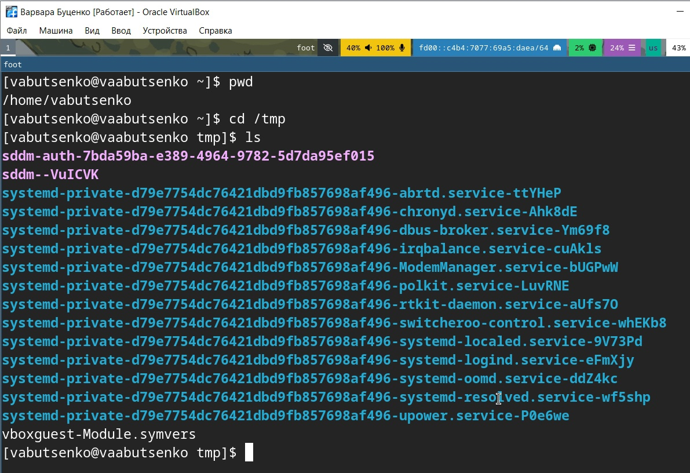{#fig:001 width=70%}

2) Выполнила следующие действия:

2.1. Перешла в каталог /tmp.

{#fig:001 width=70%}

2.2. Вывела на экран содержимое каталога /tmp. Для этого использовала команду ls с различными опциями. Разница в выводимой на экран информации:

ls | что показывает:
- Только имена файлов и подкаталогов.
- Без скрытых файлов (начинающихся с точки).
- Нет дополнительных деталей (размер, владелец, дата).

{#fig:001 width=70%}

ls -l | что показывает:
- Права доступа (например, -rw-r--r--).
- Количество ссылок.
- Владелец (user) и группа (group).
- Размер (в байтах).
- Дата последнего изменения.
- Тип файла (d для каталога, - для обычного файла).

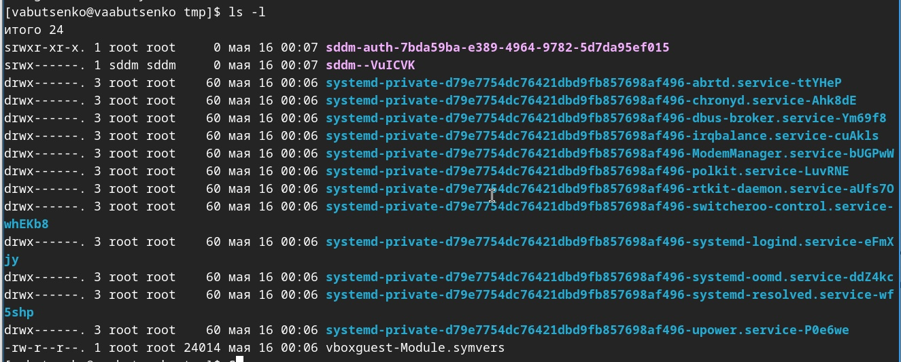{#fig:001 width=70%}

ls -a | что показывает:
- Все файлы, включая скрытые (начинающиеся с точки, например, .hidden).
- Специальные каталоги . (текущий каталог) и .. (родительский каталог).
- Нет деталей (размер, владелец).

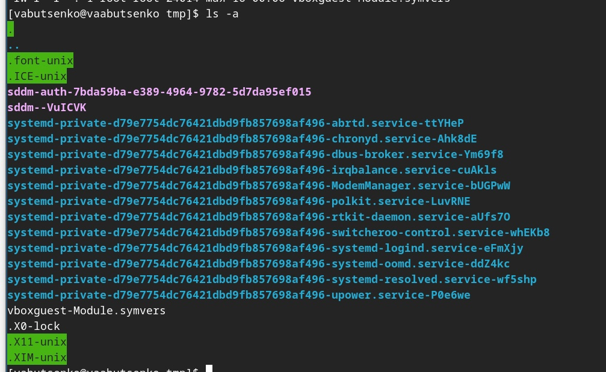{#fig:001 width=70%}

ls -alF | что показывает:
- Все файлы (включая скрытые).
- Детали (права, владелец, размер, дата).
- Типы файлов

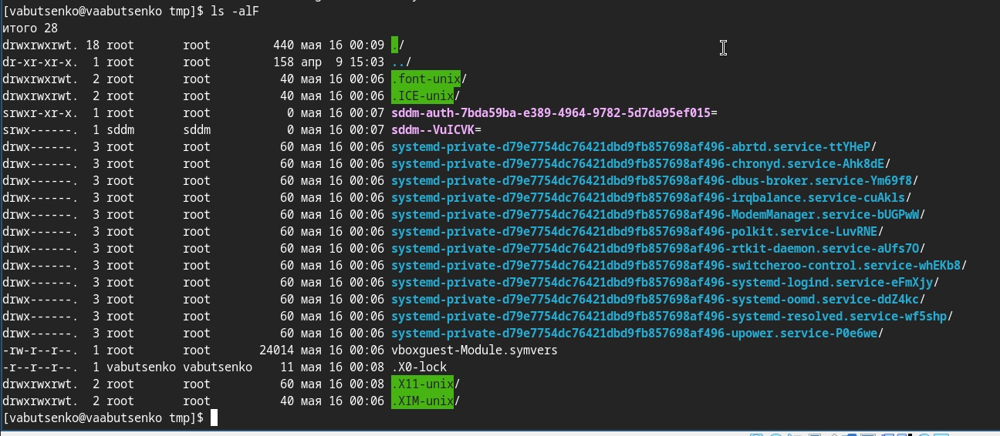{#fig:001 width=70%}

2.3. Определила, есть ли в каталоге /var/spool подкаталог с именем cron. 

- В каталоге /var/spool нет подкаталога с именем cron.

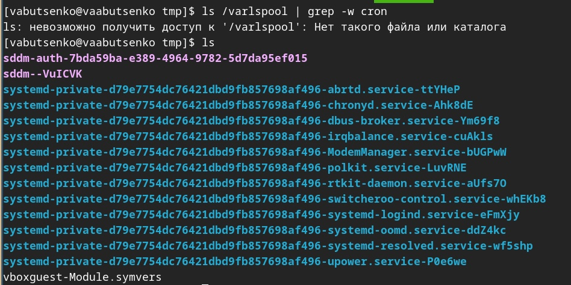{#fig:001 width=70%}

2.4. Перешла в мой домашний каталог и вывела на экран его содержимое.
Определила, кто является владельцем файлов и подкаталогов.

- Владельцем файлов и подкаталогов является vabutsenko

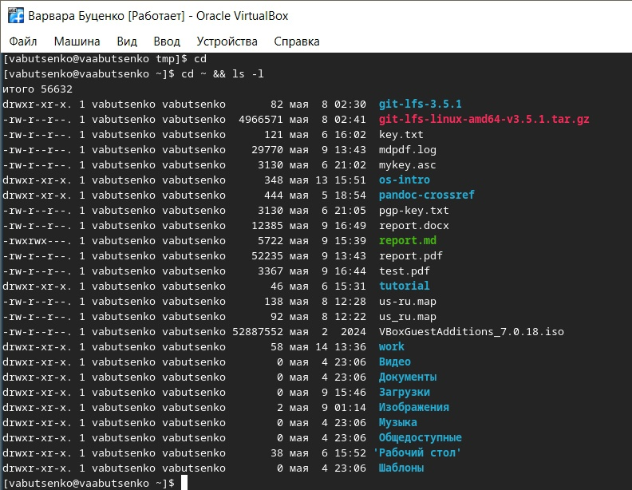{#fig:001 width=70%}

3) Выполнила следующие действия:

3.1. В домашнем каталоге создала новый каталог с именем newdir.

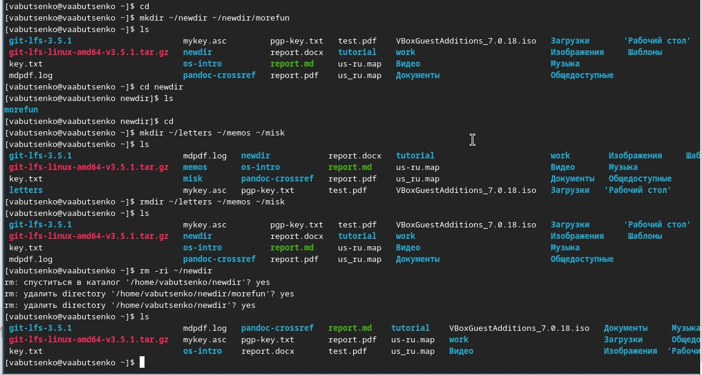{#fig:001 width=70%}

3.2. В каталоге ~/newdir создала новый каталог с именем morefun.

{#fig:001 width=70%}

3.3. В домашнем каталоге создала одной командой три новых каталога с именами letters, memos, misk. Затем удалила эти каталоги одной командой.

{#fig:001 width=70%}

3.4. Попробовала удалить ранее созданный каталог ~/newdir командой rm. Проверила, был ли каталог удалён.

{#fig:001 width=70%}

3.5. Удалила каталог ~/newdir/morefun из домашнего каталога. Проверила, был ли каталог удалён.

{#fig:001 width=70%}

4) С помощью команды man определила, какую опцию команды ls нужно использовать для просмотра содержимое не только указанного каталога, но и подкаталогов, входящих в него.

{#fig:001 width=70%}

5) С помощью команды man определила набор опций команды ls, позволяющий отсортировать по времени последнего изменения выводимый список содержимого каталога с развёрнутым описанием файлов.

{#fig:001 width=70%}

6) Использовала команду man для просмотра описания следующих команд: cd, pwd, mkdir, rmdir, rm. Основные опции этих команд.

1. Команда cd (Change Directory). Назначение: Перемещение между каталогами.
2. Команда pwd (Print Working Directory). Назначение: Вывод абсолютного пути текущего каталога.
3. Команда mkdir (Make Directory). Назначение: Создание каталогов.
4. Команда rmdir (Remove Directory). Назначение: Удаление пустых каталогов.
5. Команда rm (Remove). Назначение: Удаление файлов и каталогов (рекурсивно).

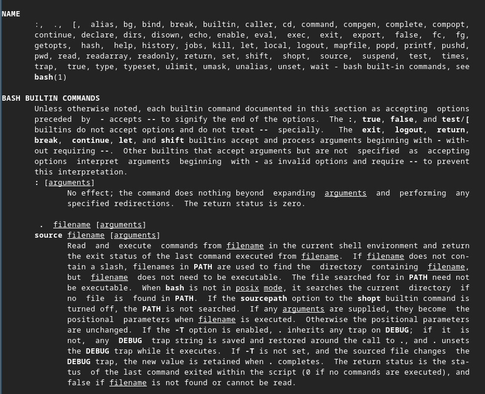{#fig:001 width=70%}

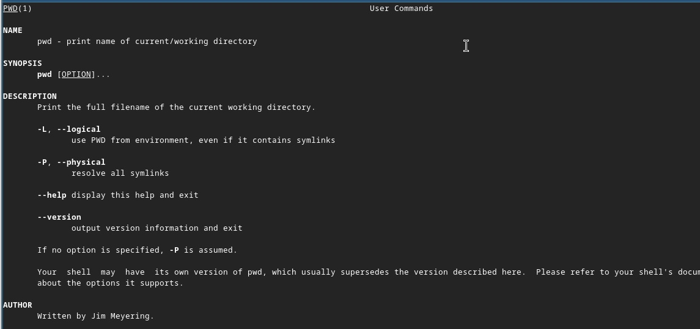{#fig:001 width=70%}

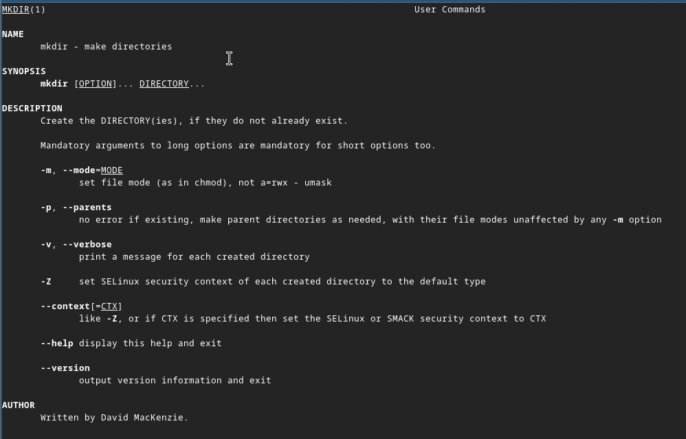{#fig:001 width=70%}

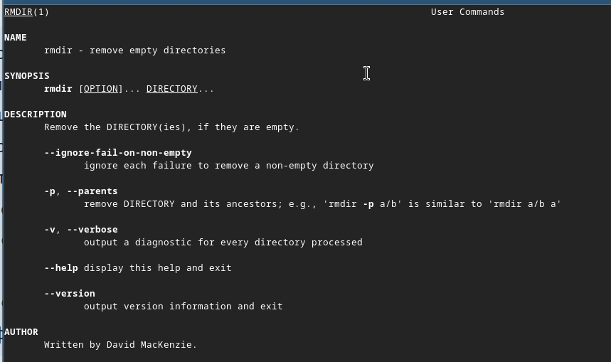{#fig:001 width=70%}

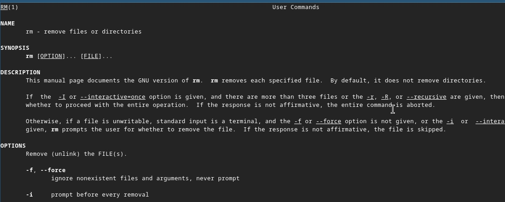{#fig:001 width=70%}

7) Используя информацию, полученную при помощи команды history, выполнила модификацию и исполнение нескольких команд из буфера обмена.

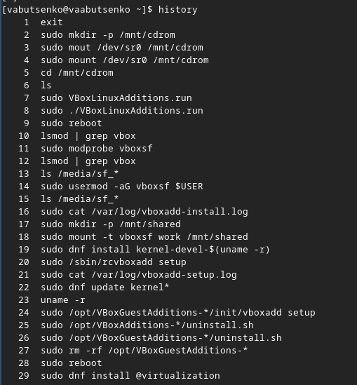{#fig:001 width=70%}

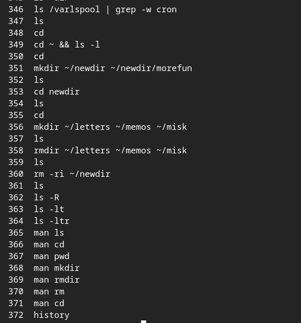{#fig:001 width=70%}

{#fig:001 width=70%}

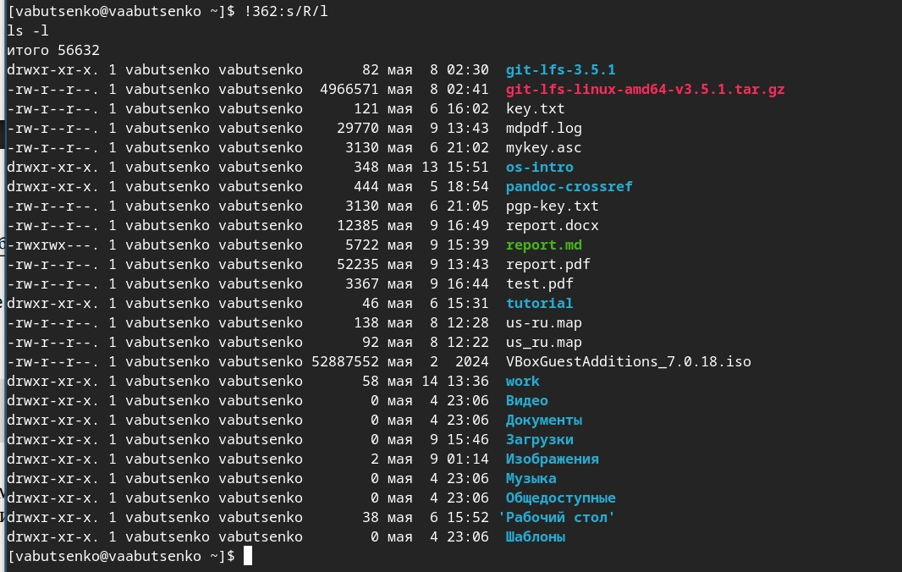{#fig:001 width=70%}

# Контрольные вопросы

1) Что такое командная строка?

- Командная строка (терминал, shell) — это текстовый интерфейс для взаимодействия с операционной системой, где пользователь вводит команды, а система выполняет их и выводит результат.

2) При помощи какой команды можно определить абсолютный путь текущего каталога? Приведите пример.

- Можно определить абсолютный путь текущего каталога командой (pwd).

3) При помощи какой команды и каких опций можно определить только тип файлов и их имена в текущем каталоге? Приведите примеры.

- Можно определить только тип файлов и их имена в текущем каталоге c помощью команды (ls -F)

4) Каким образом отобразить информацию о скрытых файлах? Приведите примеры.

- Можно отобразить информацию о скрытых файлах (ls -a)

5) При помощи каких команд можно удалить файл и каталог? Можно ли это сделать одной и той же командой? Приведите примеры.

- Можно удалить файл командой (rm file.txt), каталог (rmdir dirname).
- Да, можно удалить одной и той же командой (rm -r dirname)

6) Каким образом можно вывести информацию о последних выполненных пользователем командах? работы?

- Можно использовать команду (history)

7) Как воспользоваться историей команд для их модифицированного выполнения? Приведите примеры.

- Можно модифицировать команду из выведенного на экран списка при помощи следующей конструкции: 
- !<номер_команды>:s/<что_меняем>/<на_что_меняем>

- Пример:

- history
- 1 pwd
- 2 ls
- 3 ls -a
- !3:s/a/F
- ls -F

8) Приведите примеры запуска нескольких команд в одной строке.

- Через ; (выполнятся все, даже если предыдущая с ошибкой): ls; pwd; date
- Через && (вторая выполнится только при успехе первой): mkdir test && cd test
- Через | (передача вывода): ls -l | grep ".txt"

9) Дайте определение и приведите примера символов экранирования.

- Символы экранирования - специальные символы, которые позволяют использовать служебные символы (например, пробелы, $) как обычный текст.​

- Примеры:

- Экранирование \: echo "Цена: \$100" (Выведет: Цена: $100)

- Кавычки:
- echo 'Переменная $PATH не раскроется'
- echo "Текущий путь: $PWD"

10) Охарактеризуйте вывод информации на экран после выполнения команды ls с опцией l.

- -rw-r--r-- 1 user group 1024 May 10 10:00 file.txt

- -rw-r--r-- — права доступа,
- 1 — количество жёстких ссылок,
- user:group — владелец и группа,
- 1024 — размер в байтах,
- May 10 10:00 — дата изменения.

11) Что такое относительный путь к файлу? Приведите примеры использования относительного и абсолютного пути при выполнении какой-либо команды.

- Относительный путь к файлу - путь от текущего каталога (без / в начале).​

- Примеры: 

- Абсолютный: cat /home/user/file.txt
- Относительный (если текущий каталог /home/user): cat file.txt

12) Как получить информацию об интересующей вас команде?

- Справка: man ls
- Краткая помощь: ls --help
- Описание: whatis ls

13) Какая клавиша или комбинация клавиш служит для автоматического дополнения вводимых команд?

- Клавиша: Tab

# Выводы

- В ходе выполнения лабораторной работы были успешно выполнены все
поставленные задачи, связанные с изучением идеологии и применением средств
контроля версий, а также освоением навыков работы с системой Git. В процессе
работы были достигнуты следующие результаты:

1) Настройка базовой конфигурации Git: Были выполнены основные
настройки Git, включая указание имени пользователя, email, настройку
кодировки UTF-8, а также параметров для работы с ветками и
окончаниями строк. Это обеспечило корректную работу системы контроля
версий.

2) Создание и настройка SSH и PGP ключей: Были сгенерированы ключи SSH
(алгоритмы RSA и ed25519) и PGP, что позволило обеспечить безопасное
взаимодействие с удалёнными репозиториями и подписывание коммитов.
Ключи были успешно добавлены в аккаунт GitHub.

3) Работа с GitHub: Была выполнена аутентификация в GitHub CLI, создан
шаблон рабочего пространства, а также организована структура каталога
для выполнения заданий. Локальные изменения были зафиксированы и
отправлены на удалённый репозиторий.

5) Освоение команд Git: В процессе работы были изучены и применены
основные команды Git, такие как git init, git clone, git add, git commit,
git push, git pull, а также команды для работы с ветками и историей
изменений. Это позволило эффективно управлять версиями проекта.

# Список литературы{.unnumbered}

1. Dash, P. Getting Started with Oracle VM VirtualBox / P. Dash. – Packt Publishing Ltd, 2013. –
86 сс.
2. Colvin, H. VirtualBox: An Ultimate Guide Book on Virtualization with VirtualBox. VirtualBox /
H. Colvin. – CreateSpace Independent Publishing Platform, 2015. – 70 сс.
3. Vugt, S. van. Red Hat RHCSA/RHCE 7 cert guide : Red Hat Enterprise Linux 7 (EX200 and
EX300) : Certification Guide. Red Hat RHCSA/RHCE 7 cert guide / S. van Vugt. – Pearson IT
Certification, 2016. – 1008 сс.
4. Робачевский, А. Операционная система UNIX / А. Робачевский, С. Немнюгин, О. Стесик.
– 2-е изд. – Санкт-Петербург : БХВ-Петербург, 2010. – 656 сс.
5. Немет, Э. Unix и Linux: руководство системного администратора. Unix и Linux / Э. Немет,
Г. Снайдер, Т.Р. Хейн, Б. Уэйли. – 4-е изд. – Вильямс, 2014. – 1312 сс.
6. Колисниченко, Д.Н. Самоучитель системного администратора Linux : Системный
администратор / Д.Н. Колисниченко. – Санкт-Петербург : БХВ-Петербург, 2011. – 544 сс.
7. Robbins, A. Bash Pocket Reference / A. Robbins. – O’Reilly Media, 2016. – 156 сс.

