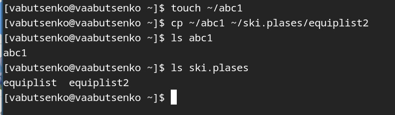
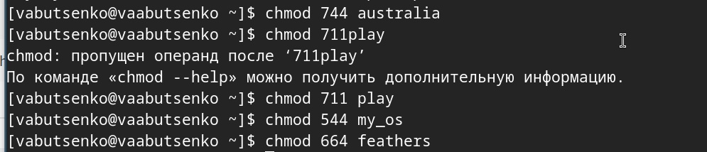
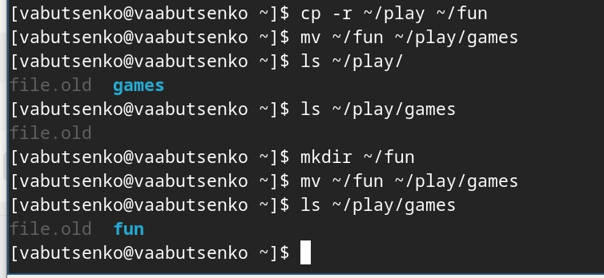
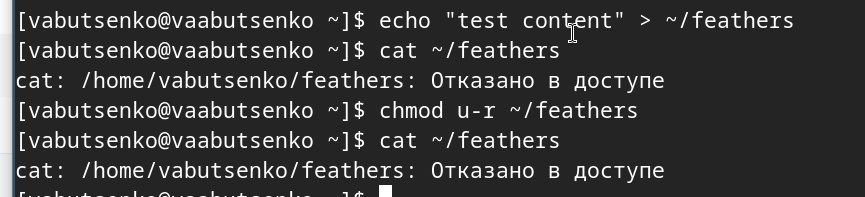
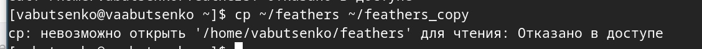

---
## Front matter
lang: ru-RU
title: Операционные системы
subtitle: Лабораторная работа №5
author:
  - Буценко В. А.
institute:
  - Российский университет дружбы народов, Москва, Россия
  - 4 курс НПМбв-02-21 
date: 19 мая 2025

## i18n babel
babel-lang: russian
babel-otherlangs: english

## Formatting pdf
toc: false
toc-title: Содержание
slide_level: 2
aspectratio: 169
section-titles: true
theme: metropolis
header-includes:
 - \metroset{progressbar=frametitle,sectionpage=progressbar,numbering=fraction}
---

# Информация

## Докладчик

:::::::::::::: {.columns align=center}
::: {.column width="70%"}

  * Буценко Варвара Алексеевна
  * студент 4 курса НПМбв-02-21
  * Российский университет дружбы народов
  * [1032200547@pfur.ru](mailto:1032200547@pfur..ru)
  * <https://github.com/vabucenko/study_2024-2025_os-intro>

:::
::: {.column width="30%"}

:::
::::::::::::::

# Вводная часть

## Задание

1. Выполните все примеры, приведённые в первой части описания лабораторной работы.

2. Выполните следующие действия, зафиксировав в отчёте по лабораторной
работе используемые при этом команды и результаты их выполнения:
- 2.1. Скопируйте файл /usr/include/sys/io.h в домашний каталог и назовите его equipment. Если файла io.h нет, то используйте любой другой файл в каталоге /usr/include/sys/ вместо него.
- 2.2. В домашнем каталоге создайте директорию ~/ski.plases.
- 2.3. Переместите файл equipment в каталог ~/ski.plases.
- 2.4. Переименуйте файл ~/ski.plases/equipment в ~/ski.plases/equiplist.
- 2.5. Создайте в домашнем каталоге файл abc1 и скопируйте его в каталог ~/ski.plases, назовите его equiplist2.
- 2.6. Создайте каталог с именем equipment в каталоге ~/ski.plases.
- 2.7. Переместите файлы ~/ski.plases/equiplist и equiplist2 в каталог ~/ski.plases/equipment.2.8. Создайте и переместите каталог ~/newdir в каталог ~/ski.plases и назовите его plans.

## Задание

3. Определите опции команды chmod, необходимые для того, чтобы присвоить перечисленным ниже файлам выделенные права доступа, считая, что в начале таких прав нет:
- 3.1. drwxr--r-- ... australia
- 3.2. drwx--x--x ... play
- 3.3. -r-xr--r-- ... my_os
- 3.4. -rw-rw-r-- ... feathers

## Задание

4. Проделайте приведённые ниже упражнения, записывая в отчёт по лабораторной работе используемые при этом команды:
- 4.1. Просмотрите содержимое файла /etc/password.
- 4.2. Скопируйте файл ~/feathers в файл ~/file.old.
- 4.3. Переместите файл ~/file.old в каталог ~/play.
- 4.4. Скопируйте каталог ~/play в каталог ~/fun.
- 4.5. Переместите каталог ~/fun в каталог ~/play и назовите его games.
- 4.6. Лишите владельца файла ~/feathers права на чтение.
- 4.7. Что произойдёт, если вы попытаетесь просмотреть файл ~/feathers командой cat?
- 4.8. Что произойдёт, если вы попытаетесь скопировать файл ~/feathers?

## Задание

- 4.9. Дайте владельцу файла ~/feathers право на чтение.
- 4.10. Лишите владельца каталога ~/play права на выполнение.
- 4.11. Перейдите в каталог ~/play. Что произошло?
- 4.12. Дайте владельцу каталога ~/play право на выполнение.

5. Прочитайте man по командам mount, fsck, mkfs, kill и кратко их охарактеризуйте, приведя примеры.

## Выполнение лабораторной работы 

1. Выполнила все примеры, приведённые в первой части описания лабораторной работы.

2. Выполнила следующие действия, зафиксировав в отчёте по лабораторной работе используемые при этом команды и результаты их выполнения:

2.1. Скопировала файл /usr/include/sys/io.h в домашний каталог и назвала его
equipment. 

cp /usr/include/sys/io.h ~/equipment

{ width=50% }

## Выполнение лабораторной работы 

2.2. В домашнем каталоге создала директорию ~/ski.plases.

команда mkdir ~/ski.plases

{ width=50% }

## Выполнение лабораторной работы 

2.3. Переместила файл equipment в каталог ~/ski.plases.

{ width=50% }

## Выполнение лабораторной работы 

2.4. Переименовала файл ~/ski.plases/equipment в ~/ski.plases/equiplist.

{ width=50% }

## Выполнение лабораторной работы 

2.5. Создала в домашнем каталоге файл abc1 и скопировала его в каталог ~/ski.plases, назвала его equiplist2.

{ width=50% }

## Выполнение лабораторной работы 

2.6. Создала каталог с именем equipment в каталоге ~/ski.plases.

{ width=50% }

## Выполнение лабораторной работы 

2.7. Переместила файлы ~/ski.plases/equiplist и equiplist2 в каталог ~/ski.plases/equipment.

{ width=50% }

## Выполнение лабораторной работы 

2.8. Создала и переместила каталог ~/newdir в каталог ~/ski.plases и назвала его plans

{ width=50% }

## Выполнение лабораторной работы 

3. Определила опции команды chmod, необходимые для того, чтобы присвоить перечисленным ниже файлам выделенные права доступа, считая, что в начале таких прав нет:
- 3.1. drwxr--r-- ... australia
- 3.2. drwx--x--x ... play
- 3.3. -r-xr--r-- ... my_os
- 3.4. -rw-rw-r-- ... feathers 

{ width=50% }

## Выполнение лабораторной работы 

4. Проделала приведённые ниже упражнения, записывая в отчёт по лабораторной работе используемые при этом команды:

4.1. Просмотрела содержимое файла /etc/password.

cat /etc/password

{ width=50% }

## Выполнение лабораторной работы 

4.2. Скопировала файл ~/feathers в файл ~/file.old.

cp ~/feathers ~/file.old

4.3. Переместила файл ~/file.old в каталог ~/play.

mv ~/file.old ~/play

{ width=50% }

## Выполнение лабораторной работы 

4.4. Скопировала каталог ~/play в каталог ~/fun.

cp -r ~/play ~/fun

{ width=50% }

## Выполнение лабораторной работы 

4.5. Переместила каталог ~/fun в каталог ~/play и назвола его games.

mv ~/fun ~/play/games

{ width=50% }

## Выполнение лабораторной работы 

4.6. Лишила владельца файла ~/feathers права на чтение.

chmod u-r ~/feathers

{ width=50% }

## Выполнение лабораторной работы 

4.7. Что произойдёт, если вы попытаетесь просмотреть файл ~/feathers командой cat?

cat ~/feathers

Вывелось на экран: отказано в доступе

{ width=50% }

## Выполнение лабораторной работы 

4.8. Что произойдёт, если вы попытаетесь скопировать файл ~/feathers?

cp ~/feathers ~/feathers_copy

Невозможно открыть - отказано в доступе

{ width=50% }

## Выполнение лабораторной работы 

4.9. Дала владельцу файла ~/feathers право на чтение.

chmod u+r ~/feathers

{ width=50% }

## Выполнение лабораторной работы 

4.10. Лишила владельца каталога ~/play права на выполнение.

chmod u-x ~/play

{ width=50% }

## Выполнение лабораторной работы 

4.11. Перейдите в каталог ~/play. Что произошло?

cd ~/play

Отказано в доступе

{ width=50% }

## Выполнение лабораторной работы 

4.12. Дала владельцу каталога ~/play право на выполнение.

chmod u+x ~/play

{ width=50% }

## Выполнение лабораторной работы 

5. Прочитала man по командам mount, fsck, mkfs, kill и кратко их охарактеризовала, приведя примеры.

- mount (монтирование файловых систем)
- пример: mount /dev/sda1 /mnt

{ width=50% }

## Выполнение лабораторной работы 

- fsck (проверка и восстановление файловых систем)
- пример: fsck /dev/sda1

{ width=50% }

## Выполнение лабораторной работы 

- mkfs (создание файловых систем)
- пример: mkfs.ext4 /dev/sda1

{ width=50% }

## Выполнение лабораторной работы 

- kill (завершение процессов)
- пример: kill %1

{ width=50% }

## Контрольные вопросы 

1) Дайте характеристику каждой файловой системе, существующей на жёстком диске компьютера, на котором вы выполняли лабораторную работу.

- Btrfs (B-tree File System)
- Тип: Современная журналируемая ФС с поддержкой снапшотов и RAID.
- Разделы: / (корневой) и /home (домашний каталог).
- Размер: 17 ГБ (использовано 13 ГБ, свободно 3.8 ГБ).

## Контрольные вопросы 

- ext4 (Fourth Extended Filesystem)
- Тип: Стандартная журналируемая ФС для Linux.
- Раздел: /boot (загрузочный раздел).

## Контрольные вопросы 

- tmpfs (Temporary File System)
- Тип: ФС в оперативной памяти.
- Разделы: /dev/shm, /run, /tmp, /run/user/1000.
- Размер: От 1 МБ до 1.2 ГБ (данные хранятся только в RAM).

## Контрольные вопросы 

- devtmpfs
- Тип: Виртуальная ФС для устройств.
- Раздел: /dev.
- Размер: 4 МБ (используется ядром для устройств).

## Контрольные вопросы 

- vboxsf (VirtualBox Shared Folder)
- Тип: ФС для обмена файлами с хостовой ОС в VirtualBox.
- Раздел: /media/sf_work.
- Размер: 117 ГБ (использовано 98 ГБ, свободно 19 ГБ).

## Контрольные вопросы 

- 1.​Btrfs — основная ФС для / и /home, обеспечивает гибкость и
отказоустойчивость.
- 2.​ ext4 — используется для /boot из-за совместимости с загрузчиками.
- 3.​ tmpfs — ускоряет работу временных файлов (например, /tmp).
- 4.​ devtmpfs — автоматически управляет устройствами.
- 5.​ vboxsf — обеспечивает обмен данными с хостовой ОС в VirtualBox.

## Контрольные вопросы 

2) Приведите общую структуру файловой системы и дайте характеристику каждой директории первого уровня этой структуры.

- В Linux используется стандартная иерархия файловой системы (FHS — Filesystem Hierarchy Standard). Ниже приведена структура корневого каталога (/) с описанием назначения каждой директории первого уровня.

1. / (Корневой каталог)
- Базовая точка монтирования всей файловой системы.
2. /bin (Binaries)
- Основные исполняемые файлы (команды), доступные всем
пользователям.

## Контрольные вопросы 

3. /boot
- Файлы, необходимые для загрузки системы (ядро, initramfs, GRUB).
4. /dev (Devices)
- Файлы устройств (жесткие диски, терминалы, USB и т.д.).
5. /etc (Etcetera)
- Конфигурационные файлы системы и программ.
6. /home
- Домашние каталоги пользователей.7. /lib и /lib64 (Libraries)
- Общие библиотеки для программ из /bin и /sbin.
8. /media и /mnt
- /media — точка монтирования съемных носителей (USB, CD-ROM).
- /mnt — временное монтирование (например, сетевые диски).

## Контрольные вопросы 

9. /opt (Optional)
- Программы, установленные вручную (не из пакетного менеджера).
10. /proc (Processes)
- Виртуальная ФС, отображающая информацию о процессах и системе.
11. /root
- Домашний каталог суперпользователя (root).
12. /run
- Временные файлы, созданные при запуске системы (PID, сокеты).
13. /sbin (System Binaries)

## Контрольные вопросы 

- Системные исполняемые файлы для root (например, fdisk, iptables).
14. /srv (Service)
- Данные сервисов (веб-сайты, FTP).

15. /sys (System)
- Виртуальная ФС для взаимодействия с ядром (настройка устройств).
16. /tmp (Temporary)Временные файлы (очищаются при перезагрузке).
17. /usr (User System Resources)
- Вторичная иерархия для программ и библиотек.
18. /var (Variable)
- Изменяемые данные (логи, кэш, почта).

## Контрольные вопросы 

3) Какая операция должна быть выполнена, чтобы содержимое некоторой файловой системы было доступно операционной системе?

- Чтобы содержимое файловой системы стало доступно операционной системе, необходимо выполнить монтирование (mounting). Это процесс подключения файловой системы к определённой точке в дереве каталогов.

## Контрольные вопросы 

4) Назовите основные причины нарушения целостности файловой системы. Как устранить повреждения файловой системы?

- Аварийное завершение работы
- Аппаратные сбои
- Ошибки ПО
- Человеческий фактор
- Переполнение диска

## Контрольные вопросы 

- Способы устранения повреждений:
- Проверка и восстановление (ext2/3/4, btrfs)
- Восстановление после переполнения
- Работа с bad-блоками
- Восстановление критических разделов

## Контрольные вопросы 

5) Как создаётся файловая система?

- Создание файловой системы — это процесс инициализации раздела диска или другого блочного устройства для хранения данных в определённом формате, который операционная система может распознавать и использовать. Этот процесс включает:

- Разметку структуры — создание необходимых метаданных, таблиц размещения файлов (например, inode в ext4) и служебных областей (суперблок, журнал).
- Настройку параметров — задание размера блока, типа журналирования, метки тома и других характеристик.
- Форматирование — запись начальной структуры данных на устройство, чтобы ОС могла взаимодействовать с ним через стандартные интерфейсы
- (чтение/запись файлов, управление правами и т.д.).

## Контрольные вопросы 

6) Дайте характеристику командам для просмотра текстовых файлов.
1. cat (concatenate)
- Вывод содержимого файла(-ов) в терминал целиком.
2. less
- Постраничный просмотр с возможностью прокрутки.​
3. more
- Упрощённый аналог less (постраничный вывод).​
4. head
- Вывод первых строк файла (по умолчанию — 10).​
5. tail
- Вывод последних строк файла (по умолчанию — 10).6. nl (number lines)
- Вывод содержимого с нумерацией строк.​

## Контрольные вопросы 

7. grep + cat (фильтрация)
- Поиск и вывод только нужных строк.
7. Приведите основные возможности команды cp в Linux.
- -rРекурсивное копирование каталогов
- -iПодтверждение перед перезаписью
- -uКопирование только новых/изменённых файлов
- -pСохранение прав и временных меток
- -aАрхивное копирование (-rp)
- -lСоздание жёсткой ссылки
- -sСоздание символической ссылки
- -fПринудительное копирование
- -vВывод информации о процессе

## Контрольные вопросы 

8) Приведите основные возможности команды mv в Linux.

- Переименование файла/каталога 
- mv старое_имя новое_имя

- Перемещение файла в другую директорию
- mv файл целевая_директория/

- Перемещение нескольких файлов
- mv файл1 файл2 файл3 целевая_директория/

- Перемещение каталога (рекурсивно)
- mv -T исходная_директория целевая_директория

## Контрольные вопросы 

9) Что такое права доступа? Как они могут быть изменены?

- Права доступа — это набор разрешений и ограничений, определяющих, какие операции могут выполняться над файлом или ресурсом в операционной системе.

- Права доступа определяют, кто может читать, записывать, изменять или выполнять определенные файлы или ресурсы.

- Права доступа могут быть изменены разными способами в зависимости от операционной системы. Вот несколько примеров:

1. Команда chmod: изменяет права доступа к файлам и каталогам.
2. Команда chown: изменяет владельца файла или каталога.
3. Команда chgrp: изменяет группу, к которой принадлежит файл.

## Выводы

- В ходе работы были изучены основные команды для работы с файлами и каталогами в Linux, такие как cp, mv, mkdir, chmod, а также команды для управления файловыми системами (mount, fsck, mkfs) и процессами (kill). 
- Приобретены практические навыки настройки прав доступа и управления файловой структурой.

5. Выполнены все задания, включая создание и удаление каталогов, проверку наличия подкаталогов и анализ прав доступа. Это позволило закрепить теоретические знания на практике.
