---
## Front matter
title: "Лабораторная работа №5"
subtitle: "Анализ файловой системы Linux. Команды для работы с файлами и каталогами"
author: "Варвара Алексеевна Буценко"

## Generic otions
lang: ru-RU
toc-title: "Содержание"

## Bibliography
bibliography: bib/cite.bib
csl: pandoc/csl/gost-r-7-0-5-2008-numeric.csl

## Pdf output format
toc: true # Table of contents
toc-depth: 2
lof: true # List of figures
lot: true # List of tables
fontsize: 12pt
linestretch: 1.5
papersize: a4
documentclass: scrreprt
## I18n polyglossia
polyglossia-lang:
  name: russian
  options:
	- spelling=modern
	- babelshorthands=true
polyglossia-otherlangs:
  name: english
## I18n babel
babel-lang: russian
babel-otherlangs: english
## Fonts
mainfont: IBM Plex Serif
romanfont: IBM Plex Serif
sansfont: IBM Plex Sans
monofont: IBM Plex Mono
mathfont: STIX Two Math
mainfontoptions: Ligatures=Common,Ligatures=TeX,Scale=0.94
romanfontoptions: Ligatures=Common,Ligatures=TeX,Scale=0.94
sansfontoptions: Ligatures=Common,Ligatures=TeX,Scale=MatchLowercase,Scale=0.94
monofontoptions: Scale=MatchLowercase,Scale=0.94,FakeStretch=0.9
mathfontoptions:
## Biblatex
biblatex: true
biblio-style: "gost-numeric"
biblatexoptions:
    - parentracker=true
    - backend=biber
    - hyperref=auto
    - language=auto
    - autolang=other*
    - citestyle=gost-numeric
## Pandoc-crossref LaTeX customization
figureTitle: "Рис."
tableTitle: "Таблица"
listingTitle: "Листинг"
lofTitle: "Список иллюстраций"
lotTitle: "Список таблиц"
lolTitle: "Листинги"
## Misc options
indent: true
header-includes:
    - \usepackage{indentfirst}
    - \usepackage{float} # keep figures where there are in the text
    - \floatplacement{figure}{H} # keep figures where there are in the text
---

# Цель работы

Ознакомление с файловой системой Linux, её структурой, именами и содержанием каталогов. Приобретение практических навыков по применению команд для работы с файлами и каталогами, по управлению процессами (и работами), по проверке использования диска и обслуживанию файловой системы.

# Задание 

1. Выполните все примеры, приведённые в первой части описания лабораторной работы.

2. Выполните следующие действия, зафиксировав в отчёте по лабораторной
работе используемые при этом команды и результаты их выполнения:
- 2.1. Скопируйте файл /usr/include/sys/io.h в домашний каталог и назовите его equipment. Если файла io.h нет, то используйте любой другой файл в каталоге /usr/include/sys/ вместо него.
- 2.2. В домашнем каталоге создайте директорию ~/ski.plases.
- 2.3. Переместите файл equipment в каталог ~/ski.plases.
- 2.4. Переименуйте файл ~/ski.plases/equipment в ~/ski.plases/equiplist.
- 2.5. Создайте в домашнем каталоге файл abc1 и скопируйте его в каталог ~/ski.plases, назовите его equiplist2.
- 2.6. Создайте каталог с именем equipment в каталоге ~/ski.plases.
- 2.7. Переместите файлы ~/ski.plases/equiplist и equiplist2 в каталог ~/ski.plases/equipment.2.8. Создайте и переместите каталог ~/newdir в каталог ~/ski.plases и назовите его plans.

3. Определите опции команды chmod, необходимые для того, чтобы присвоить перечисленным ниже файлам выделенные права доступа, считая, что в начале таких прав нет:
- 3.1. drwxr--r-- ... australia
- 3.2. drwx--x--x ... play
- 3.3. -r-xr--r-- ... my_os
- 3.4. -rw-rw-r-- ... feathers

4. Проделайте приведённые ниже упражнения, записывая в отчёт по лабораторной работе используемые при этом команды:
- 4.1. Просмотрите содержимое файла /etc/password.
- 4.2. Скопируйте файл ~/feathers в файл ~/file.old.
- 4.3. Переместите файл ~/file.old в каталог ~/play.
- 4.4. Скопируйте каталог ~/play в каталог ~/fun.
- 4.5. Переместите каталог ~/fun в каталог ~/play и назовите его games.
- 4.6. Лишите владельца файла ~/feathers права на чтение.
- 4.7. Что произойдёт, если вы попытаетесь просмотреть файл ~/feathers командой cat?
- 4.8. Что произойдёт, если вы попытаетесь скопировать файл ~/feathers?
- 4.9. Дайте владельцу файла ~/feathers право на чтение.
- 4.10. Лишите владельца каталога ~/play права на выполнение.
- 4.11. Перейдите в каталог ~/play. Что произошло?
- 4.12. Дайте владельцу каталога ~/play право на выполнение.

5. Прочитайте man по командам mount, fsck, mkfs, kill и кратко их охарактеризуйте, приведя примеры.

# Теоретическое введение

Здесь описываются теоретические аспекты, связанные с выполнением работы.

Вся необходимая теория по лабораторной работе №5 находится в разделе курса "Операционные сестемы" по ссылке https://esystem.rudn.ru/pluginfile.php/2295255/mod_resource/content/4/005-lab_files
.pdf

# Выполнение лабораторной работы

1. Выполнила все примеры, приведённые в первой части описания лабораторной работы.

2. Выполнила следующие действия, зафиксировав в отчёте по лабораторной работе используемые при этом команды и результаты их выполнения:

2.1. Скопировала файл /usr/include/sys/io.h в домашний каталог и назвала его
equipment. 

cp /usr/include/sys/io.h ~/equipment

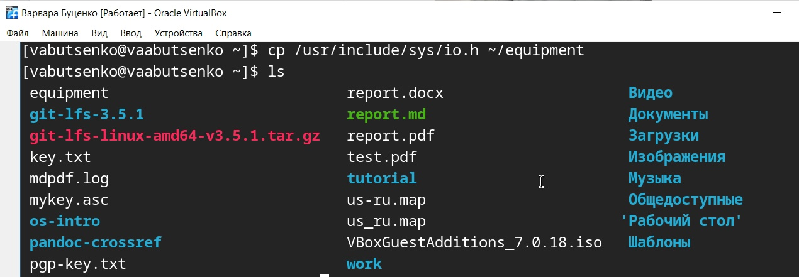{#fig:001 width=70%}

2.2. В домашнем каталоге создала директорию ~/ski.plases.

команда mkdir ~/ski.plases

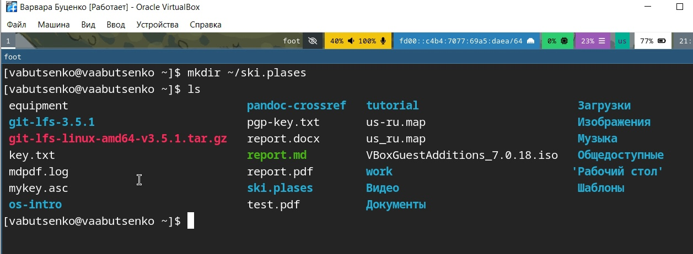{#fig:001 width=70%}

2.3. Переместила файл equipment в каталог ~/ski.plases.

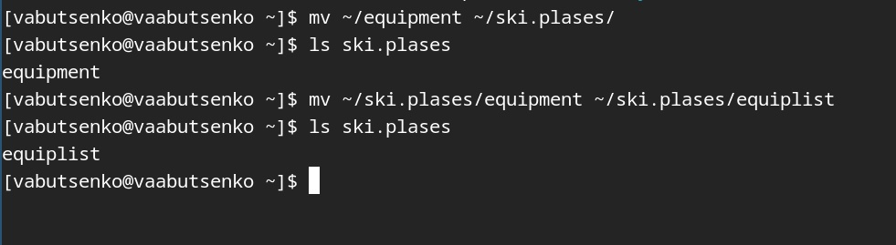{#fig:001 width=70%}

2.4. Переименовала файл ~/ski.plases/equipment в ~/ski.plases/equiplist.

{#fig:001 width=70%}

2.5. Создала в домашнем каталоге файл abc1 и скопировала его в каталог ~/ski.plases, назвала его equiplist2.

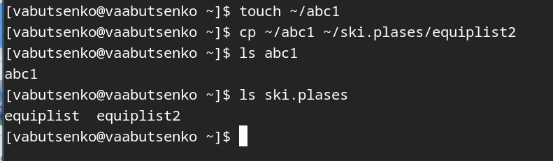{#fig:001 width=70%}

2.6. Создала каталог с именем equipment в каталоге ~/ski.plases.

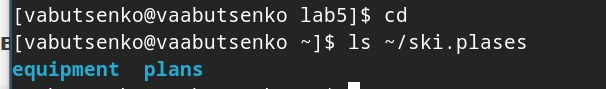{#fig:001 width=70%}

2.7. Переместила файлы ~/ski.plases/equiplist и equiplist2 в каталог ~/ski.plases/equipment.

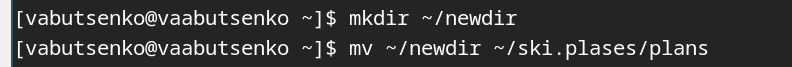{#fig:001 width=70%}

2.8. Создала и переместила каталог ~/newdir в каталог ~/ski.plases и назвала его plans

{#fig:001 width=70%}

3. Определила опции команды chmod, необходимые для того, чтобы присвоить перечисленным ниже файлам выделенные права доступа, считая, что в начале таких прав нет:
- 3.1. drwxr--r-- ... australia
- 3.2. drwx--x--x ... play
- 3.3. -r-xr--r-- ... my_os
- 3.4. -rw-rw-r-- ... feathers 

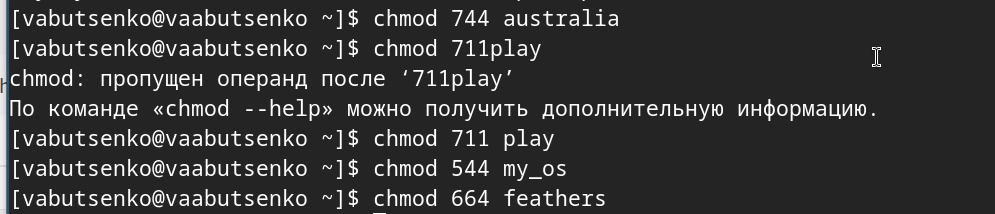{#fig:001 width=70%}

4. Проделала приведённые ниже упражнения, записывая в отчёт по лабораторной работе используемые при этом команды:

4.1. Просмотрела содержимое файла /etc/password.

cat /etc/password

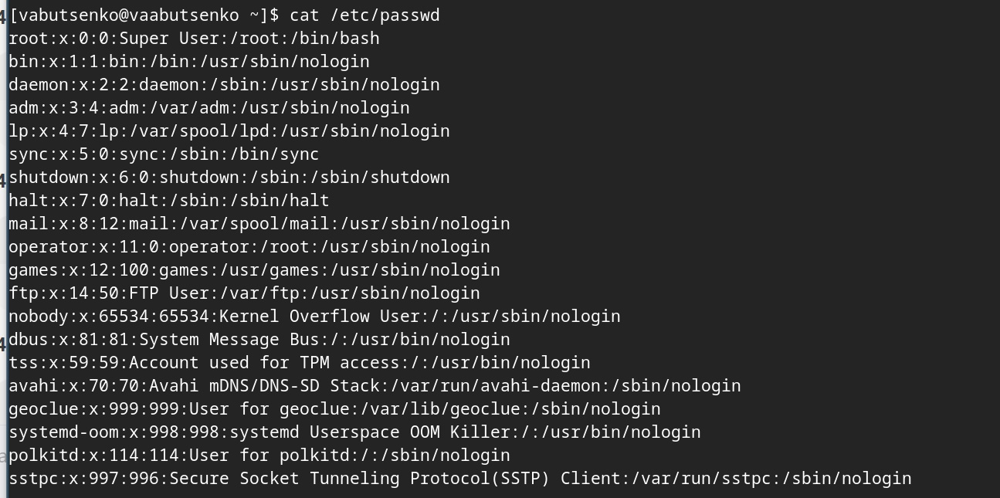{#fig:001 width=70%}

4.2. Скопировала файл ~/feathers в файл ~/file.old.

cp ~/feathers ~/file.old

4.3. Переместила файл ~/file.old в каталог ~/play.

mv ~/file.old ~/play

{#fig:001 width=70%}

4.4. Скопировала каталог ~/play в каталог ~/fun.

cp -r ~/play ~/fun

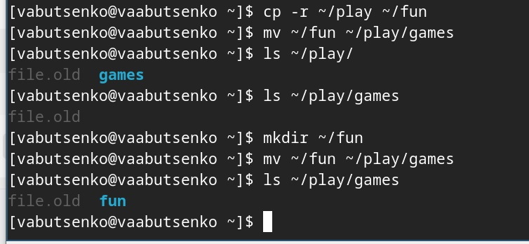{#fig:001 width=70%}

4.5. Переместила каталог ~/fun в каталог ~/play и назвола его games.

mv ~/fun ~/play/games

{#fig:001 width=70%}

4.6. Лишила владельца файла ~/feathers права на чтение.

chmod u-r ~/feathers

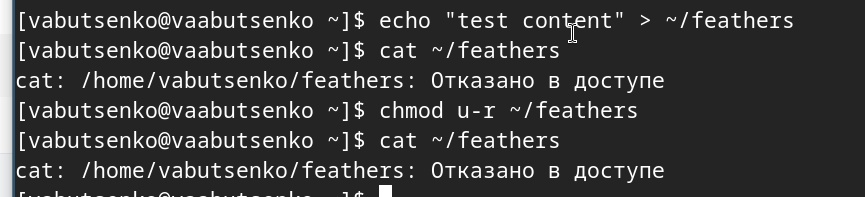{#fig:001 width=70%}

4.7. Что произойдёт, если вы попытаетесь просмотреть файл ~/feathers командой cat?

cat ~/feathers

Вывелось на экран: отказано в доступе

{#fig:001 width=70%}

4.8. Что произойдёт, если вы попытаетесь скопировать файл ~/feathers?

cp ~/feathers ~/feathers_copy

Невозможно открыть - отказано в доступе

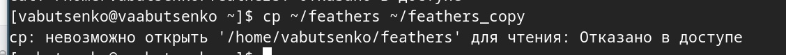{#fig:001 width=70%}

4.9. Дала владельцу файла ~/feathers право на чтение.

chmod u+r ~/feathers

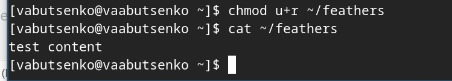{#fig:001 width=70%}

4.10. Лишила владельца каталога ~/play права на выполнение.

chmod u-x ~/play

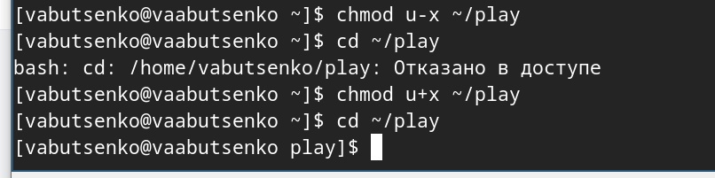{#fig:001 width=70%}

4.11. Перейдите в каталог ~/play. Что произошло?

cd ~/play

Отказано в доступе

{#fig:001 width=70%}

4.12. Дала владельцу каталога ~/play право на выполнение.

chmod u+x ~/play

{#fig:001 width=70%}

5. Прочитала man по командам mount, fsck, mkfs, kill и кратко их охарактеризовала, приведя примеры.

- mount (монтирование файловых систем)
- пример: mount /dev/sda1 /mnt

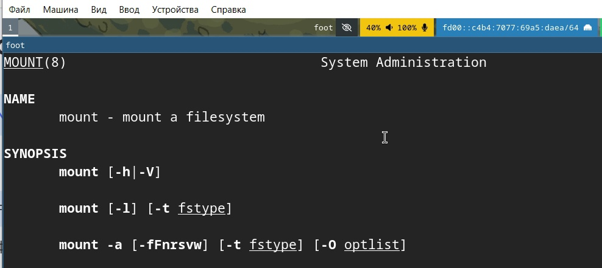{#fig:001 width=70%}

- fsck (проверка и восстановление файловых систем)
- пример: fsck /dev/sda1

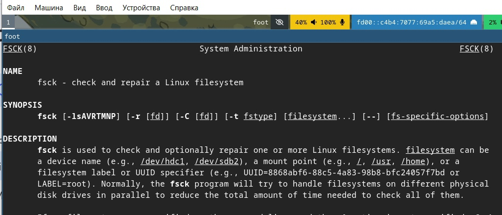{#fig:001 width=70%}

- mkfs (создание файловых систем)
- пример: mkfs.ext4 /dev/sda1

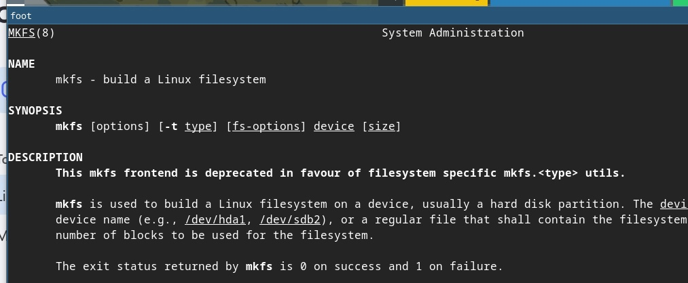{#fig:001 width=70%}

- kill (завершение процессов)
- пример: kill %1

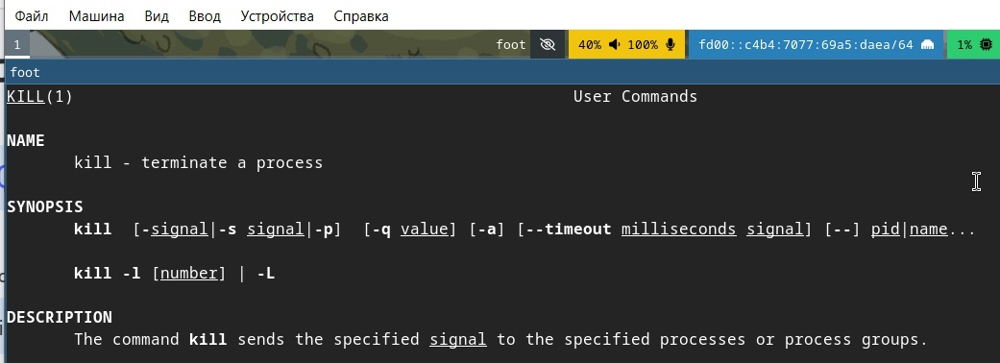{#fig:001 width=70%}

# Контрольные вопросы

1) Дайте характеристику каждой файловой системе, существующей на жёстком диске компьютера, на котором вы выполняли лабораторную работу.

- Btrfs (B-tree File System)
- Тип: Современная журналируемая ФС с поддержкой снапшотов и RAID.
- Разделы: / (корневой) и /home (домашний каталог).
- Размер: 17 ГБ (использовано 13 ГБ, свободно 3.8 ГБ).

- ext4 (Fourth Extended Filesystem)
- Тип: Стандартная журналируемая ФС для Linux.
- Раздел: /boot (загрузочный раздел).

- tmpfs (Temporary File System)
- Тип: ФС в оперативной памяти.
- Разделы: /dev/shm, /run, /tmp, /run/user/1000.
- Размер: От 1 МБ до 1.2 ГБ (данные хранятся только в RAM).

- devtmpfs
- Тип: Виртуальная ФС для устройств.
- Раздел: /dev.
- Размер: 4 МБ (используется ядром для устройств).

- vboxsf (VirtualBox Shared Folder)
- Тип: ФС для обмена файлами с хостовой ОС в VirtualBox.
- Раздел: /media/sf_work.
- Размер: 117 ГБ (использовано 98 ГБ, свободно 19 ГБ).

- 1.​Btrfs — основная ФС для / и /home, обеспечивает гибкость и
отказоустойчивость.
- 2.​ ext4 — используется для /boot из-за совместимости с загрузчиками.
- 3.​ tmpfs — ускоряет работу временных файлов (например, /tmp).
- 4.​ devtmpfs — автоматически управляет устройствами.
- 5.​ vboxsf — обеспечивает обмен данными с хостовой ОС в VirtualBox.

2) Приведите общую структуру файловой системы и дайте характеристику каждой директории первого уровня этой структуры.

- В Linux используется стандартная иерархия файловой системы (FHS — Filesystem Hierarchy Standard). Ниже приведена структура корневого каталога (/) с описанием назначения каждой директории первого уровня.

1. / (Корневой каталог)
- Базовая точка монтирования всей файловой системы.
2. /bin (Binaries)
- Основные исполняемые файлы (команды), доступные всем
пользователям.
3. /boot
- Файлы, необходимые для загрузки системы (ядро, initramfs, GRUB).
4. /dev (Devices)
- Файлы устройств (жесткие диски, терминалы, USB и т.д.).
5. /etc (Etcetera)
- Конфигурационные файлы системы и программ.
6. /home
- Домашние каталоги пользователей.7. /lib и /lib64 (Libraries)
- Общие библиотеки для программ из /bin и /sbin.
8. /media и /mnt
- /media — точка монтирования съемных носителей (USB, CD-ROM).
- /mnt — временное монтирование (например, сетевые диски).
9. /opt (Optional)
- Программы, установленные вручную (не из пакетного менеджера).
10. /proc (Processes)
- Виртуальная ФС, отображающая информацию о процессах и системе.
11. /root
- Домашний каталог суперпользователя (root).
12. /run
- Временные файлы, созданные при запуске системы (PID, сокеты).
13. /sbin (System Binaries)
- Системные исполняемые файлы для root (например, fdisk, iptables).
14. /srv (Service)
- Данные сервисов (веб-сайты, FTP).
15. /sys (System)
- Виртуальная ФС для взаимодействия с ядром (настройка устройств).
16. /tmp (Temporary)Временные файлы (очищаются при перезагрузке).
17. /usr (User System Resources)
- Вторичная иерархия для программ и библиотек.
18. /var (Variable)
- Изменяемые данные (логи, кэш, почта).

3) Какая операция должна быть выполнена, чтобы содержимое некоторой файловой системы было доступно операционной системе?

- Чтобы содержимое файловой системы стало доступно операционной системе, необходимо выполнить монтирование (mounting). Это процесс подключения файловой системы к определённой точке в дереве каталогов.

4) Назовите основные причины нарушения целостности файловой системы. Как устранить повреждения файловой системы?

- Аварийное завершение работы
- Аппаратные сбои
- Ошибки ПО
- Человеческий фактор
- Переполнение диска

- Способы устранения повреждений:
- Проверка и восстановление (ext2/3/4, btrfs)
- Восстановление после переполнения
- Работа с bad-блоками
- Восстановление критических разделов

5) Как создаётся файловая система?

- Создание файловой системы — это процесс инициализации раздела диска или другого блочного устройства для хранения данных в определённом формате, который операционная система может распознавать и использовать. Этот процесс включает:

- Разметку структуры — создание необходимых метаданных, таблиц размещения файлов (например, inode в ext4) и служебных областей (суперблок, журнал).
- Настройку параметров — задание размера блока, типа журналирования, метки тома и других характеристик.
- Форматирование — запись начальной структуры данных на устройство, чтобы ОС могла взаимодействовать с ним через стандартные интерфейсы
- (чтение/запись файлов, управление правами и т.д.).

6) Дайте характеристику командам для просмотра текстовых файлов.
1. cat (concatenate)
- Вывод содержимого файла(-ов) в терминал целиком.
2. less
- Постраничный просмотр с возможностью прокрутки.​
3. more
- Упрощённый аналог less (постраничный вывод).​
4. head
- Вывод первых строк файла (по умолчанию — 10).​
5. tail
- Вывод последних строк файла (по умолчанию — 10).6. nl (number lines)
- Вывод содержимого с нумерацией строк.​
7. grep + cat (фильтрация)
- Поиск и вывод только нужных строк.
7. Приведите основные возможности команды cp в Linux.
- -rРекурсивное копирование каталогов
- -iПодтверждение перед перезаписью
- -uКопирование только новых/изменённых файлов
- -pСохранение прав и временных меток
- -aАрхивное копирование (-rp)
- -lСоздание жёсткой ссылки
- -sСоздание символической ссылки
- -fПринудительное копирование
- -vВывод информации о процессе

8) Приведите основные возможности команды mv в Linux.

- Переименование файла/каталога 
- mv старое_имя новое_имя

- Перемещение файла в другую директорию
- mv файл целевая_директория/

- Перемещение нескольких файлов
- mv файл1 файл2 файл3 целевая_директория/

- Перемещение каталога (рекурсивно)
- mv -T исходная_директория целевая_директория

9) Что такое права доступа? Как они могут быть изменены?

- Права доступа — это набор разрешений и ограничений, определяющих, какие операции могут выполняться над файлом или ресурсом в операционной системе.

- Права доступа определяют, кто может читать, записывать, изменять или выполнять определенные файлы или ресурсы.

- Права доступа могут быть изменены разными способами в зависимости от операционной системы. Вот несколько примеров:

1. Команда chmod: изменяет права доступа к файлам и каталогам.
2. Команда chown: изменяет владельца файла или каталога.
3. Команда chgrp: изменяет группу, к которой принадлежит файл.

# Выводы

- В ходе работы были изучены основные команды для работы с файлами и каталогами в Linux, такие как cp, mv, mkdir, chmod, а также команды для управления файловыми системами (mount, fsck, mkfs) и процессами (kill). 
- Приобретены практические навыки настройки прав доступа и управления файловой структурой.

# Список литературы{.unnumbered}

1. Dash, P. Getting Started with Oracle VM VirtualBox / P. Dash. – Packt Publishing Ltd, 2013. –
86 сс.
2. Colvin, H. VirtualBox: An Ultimate Guide Book on Virtualization with VirtualBox. VirtualBox /
H. Colvin. – CreateSpace Independent Publishing Platform, 2015. – 70 сс.
3. Vugt, S. van. Red Hat RHCSA/RHCE 7 cert guide : Red Hat Enterprise Linux 7 (EX200 and
EX300) : Certification Guide. Red Hat RHCSA/RHCE 7 cert guide / S. van Vugt. – Pearson IT
Certification, 2016. – 1008 сс.
4. Робачевский, А. Операционная система UNIX / А. Робачевский, С. Немнюгин, О. Стесик.
– 2-е изд. – Санкт-Петербург : БХВ-Петербург, 2010. – 656 сс.
5. Немет, Э. Unix и Linux: руководство системного администратора. Unix и Linux / Э. Немет,
Г. Снайдер, Т.Р. Хейн, Б. Уэйли. – 4-е изд. – Вильямс, 2014. – 1312 сс.
6. Колисниченко, Д.Н. Самоучитель системного администратора Linux : Системный
администратор / Д.Н. Колисниченко. – Санкт-Петербург : БХВ-Петербург, 2011. – 544 сс.
7. Robbins, A. Bash Pocket Reference / A. Robbins. – O’Reilly Media, 2016. – 156 сс.

