---
## Front matter
lang: ru-RU
title: Операционные системы
subtitle: Лабораторная работа №6
author:
  - Буценко В. А.
institute:
  - Российский университет дружбы народов, Москва, Россия
  - 4 курс НПМбв-02-21 
date: 20 мая 2025

## i18n babel
babel-lang: russian
babel-otherlangs: english

## Formatting pdf
toc: false
toc-title: Содержание
slide_level: 2
aspectratio: 169
section-titles: true
theme: metropolis
header-includes:
 - \metroset{progressbar=frametitle,sectionpage=progressbar,numbering=fraction}
---

# Информация

## Докладчик

:::::::::::::: {.columns align=center}
::: {.column width="70%"}

  * Буценко Варвара Алексеевна
  * студент 4 курса НПМбв-02-21
  * Российский университет дружбы народов
  * [1032200547@pfur.ru](mailto:1032200547@pfur..ru)
  * <https://github.com/vabucenko/study_2024-2025_os-intro>

:::
::: {.column width="30%"}

:::
::::::::::::::

# Вводная часть

## Задание

1. Осуществите вход в систему, используя соответствующее имя пользователя.
2. Запишите в файл file.txt названия файлов, содержащихся в каталоге /etc. Допишите в этот же файл названия файлов, содержащихся в вашем домашнем каталоге.
3. Выведите имена всех файлов из file.txt, имеющих расширение .conf, после чего запишите их в новый текстовой файл conf.txt.
4. Определите, какие файлы в вашем домашнем каталоге имеют имена, начинавшиеся с символа c? Предложите несколько вариантов, как это сделать.
5. Выведите на экран (по странично) имена файлов из каталога /etc, начинающиеся с символа h.
6. Запустите в фоновом режиме процесс, который будет записывать в файл ~/logfile файлы, имена которых начинаются с log.
7. Удалите файл ~/logfile.

## Задание

8. Запустите из консоли в фоновом режиме редактор gedit.
9. Определите идентификатор процесса gedit, используя команду ps, конвейер и фильтр grep. Как ещё можно определить идентификатор процесса?
10. Прочтите справку (man) командыkill, после чего используйте её для завершения процесса gedit.
11. Выполните команды df и du, предварительно получив более подробную информацию об этих командах, с помощью команды man.
12. Воспользовавшись справкой команды find, выведите имена всех директорий, имеющихся в вашем домашнем каталоге

## Выполнение лабораторной работы 

1. Осуществила вход в систему, используя соответствующее имя пользователя.

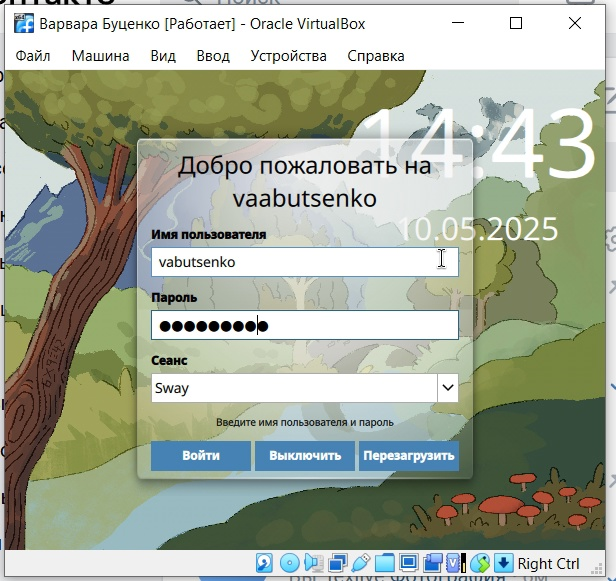{ width=50% }

## Выполнение лабораторной работы 

2. Записала в файл file.txt названия файлов, содержащихся в каталоге /etc. 

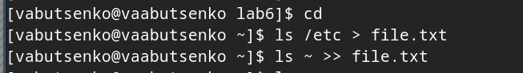{ width=50% }

## Выполнение лабораторной работы 

Дописала в этот же файл названия файлов, содержащихся в вашем домашнем каталоге.

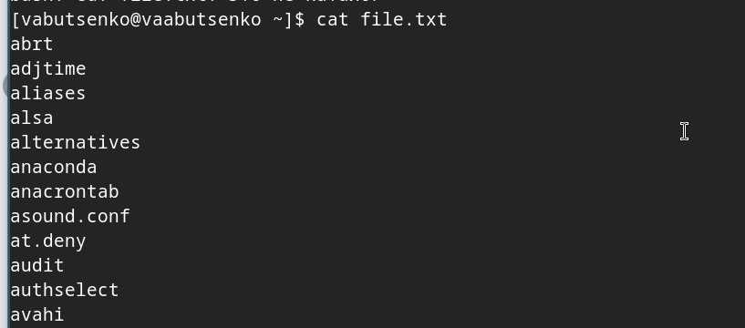{ width=50% }

## Выполнение лабораторной работы 

3. Вывела имена всех файлов из file.txt, имеющих расширение .conf, после чего записала их в новый текстовой файл conf.txt.

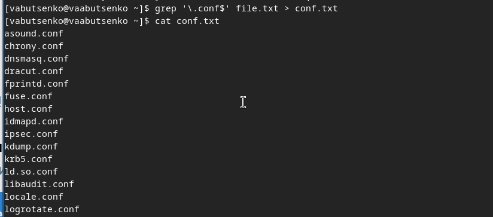{ width=50% }

## Выполнение лабораторной работы 

4. Определила, какие файлы в вашем домашнем каталоге имеют имена, начинавшиеся с символа c. 

- ls ~/c*
- find ~ -name "c*"
- ls ~ | grep '^c'

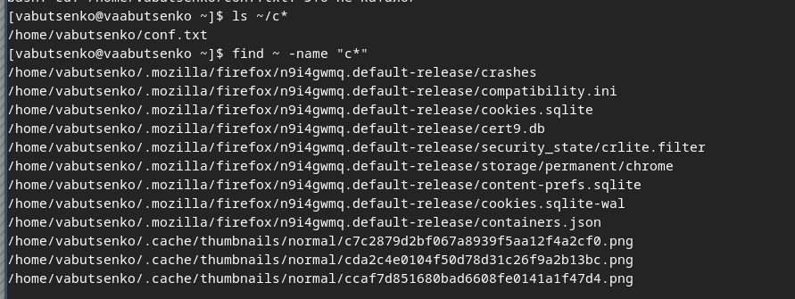{ width=50% }

## Выполнение лабораторной работы 

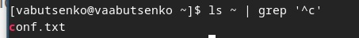{ width=50% }

## Выполнение лабораторной работы 

5. Вывела на экран (по странично) имена файлов из каталога /etc, начинающиеся с символа h.

.jpg){ width=50% }

## Выполнение лабораторной работы 

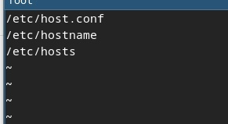{ width=50% }

## Выполнение лабораторной работы 

6. Запустила в фоновом режиме процесс, который будет записывать в файл ~/logfile файлы, имена которых начинаются с log.

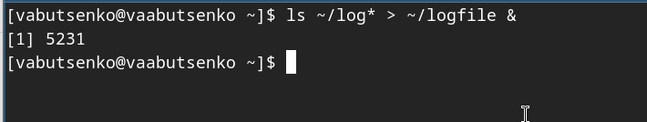{ width=50% }

## Выполнение лабораторной работы 

7. Удалила файл ~/logfile.

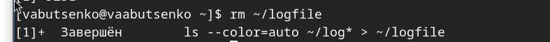{ width=50% }

## Выполнение лабораторной работы 

8. Запустила из консоли в фоновом режиме редактор gedit.

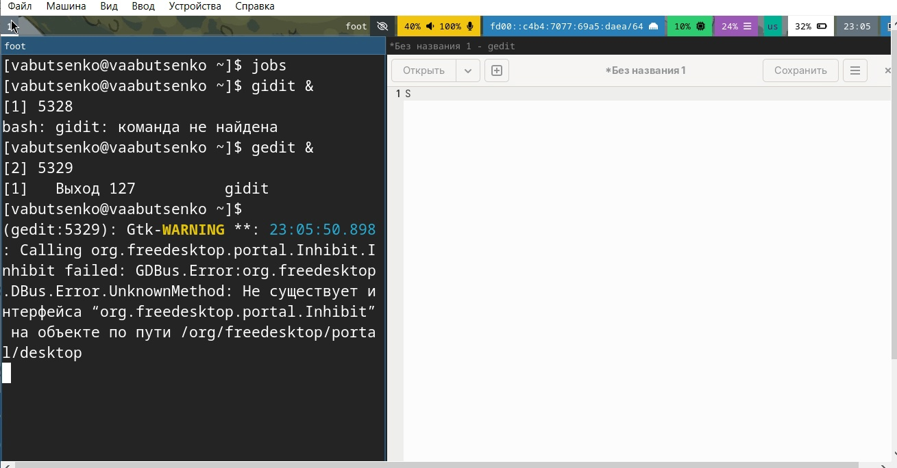{ width=50% }

## Выполнение лабораторной работы 

9. Определила идентификатор процесса gedit, используя команду ps, конвейер и фильтр grep. Как ещё можно определить идентификатор процесса?

- ps aux | grep gedit
- pgrep gedit

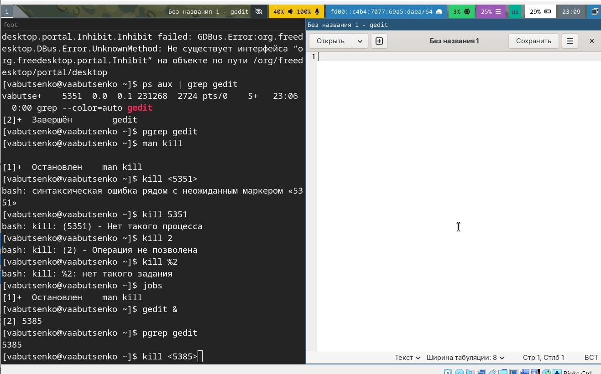{ width=50% }

## Выполнение лабораторной работы 

10. Прочитала справку (man) команды kill, после чего использовала её для завершения процесса gedit.

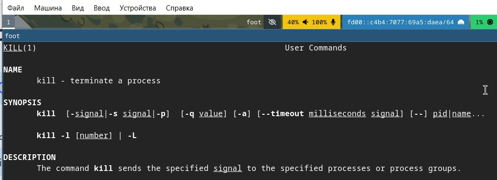{ width=50% }

## Выполнение лабораторной работы 

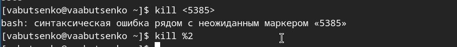{ width=50% }

## Выполнение лабораторной работы 

11. Выполнила команды df и du, предварительно получив более подробную информацию об этих командах, с помощью команды man.

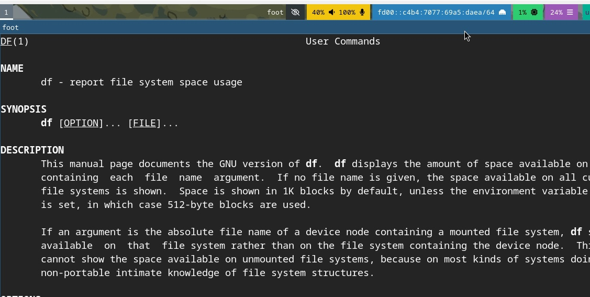{ width=50% }

## Выполнение лабораторной работы 

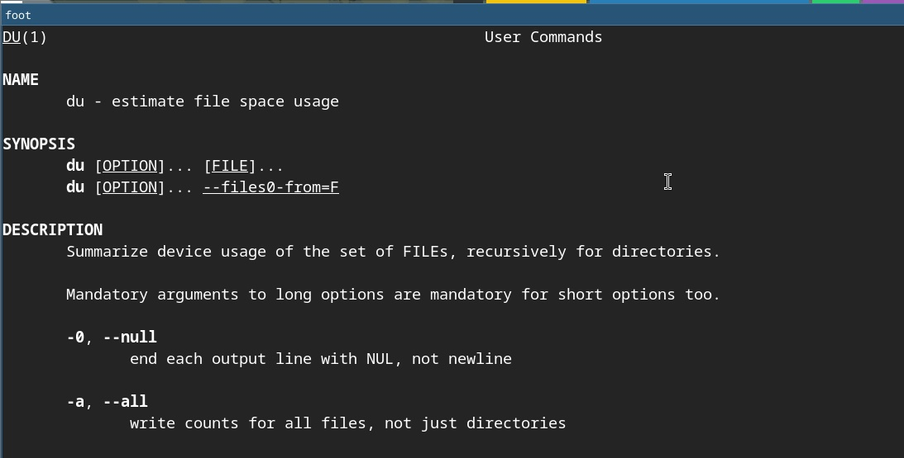{ width=50% }

## Выполнение лабораторной работы 

12. Воспользовавшись справкой команды find, вывела имена всех директорий, имеющихся в вашем домашнем каталоге

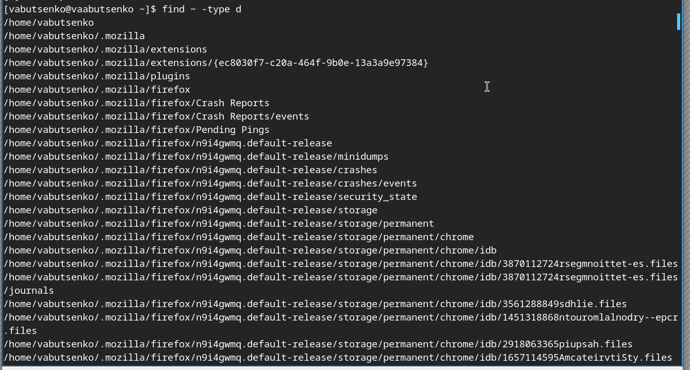{ width=50% }

## Контрольные вопросы 

1. Какие потоки ввода-вывода вы знаете?
- В Linux и Unix-подобных системах существуют стандартные потоки ввода-вывода:
- Стандартный ввод (stdin): обычно связан с клавиатурой.
- Стандартный вывод (stdout): обычно связан с экраном (консолью).
- Стандартный вывод ошибок (stderr): также связан с экраном и используется для вывода сообщений об ошибках.

## Контрольные вопросы 

2. Объясните разницу между операцией > и >>.

- ">": используется для перенаправления вывода команды в файл. Если файл уже существует, он будет перезаписан.

- echo "hello" > file.txt (при существовании)
- Запишет "hello" в file.txt, перезаписав его 

- ">>": используется для добавления вывода команды в конец файла. Если файл не существует, он будет создан.

-echo "world" >> file.txt
-file.txt. (Добавит "world" в конец уже существующего)

## Контрольные вопросы 

3. Что такое конвейер?

- Конвейер (pipeline) — это механизм, который позволяет передавать вывод одной команды как ввод для другой команды, обычно с помощью оператора |.

- Например:
- ls | grep ".txt" (Переводит выход команды ls в качестве ввода для grep).

## Контрольные вопросы 

4. Что такое процесс? Чем это понятие отличается от программы?

- Процесс — это экземпляр программы, который выполняется в операционной системе. Он имеет свое состояние, включая данные, указатели выполнения и ресурсы.

- Программа — это статический набор инструкций и данных, хранящихся на диске. 

- Процесс — это динамическое выполнение программы. При запуске программы создается процесс.

## Контрольные вопросы 

5. Что такое PID и GID?

- PID (Process ID) — это уникальный идентификатор процесса, присвоенный ему системой при создании.
- GID (Group ID) — это идентификатор группы, которому принадлежит процесс. Он используется для управления правами доступа и групповой активностью процессов.

## Контрольные вопросы 

6. Что такое задачи и какая команда позволяет ими управлять?

- Задачи (jobs) — это процессы, выполняемые в фоне или в переднем плане. Для управления такими задачами можно использовать следующие команды:

- jobs — показывает список текущих задач.
- fg %<номер> — переводит задачу в передний план.
- bg %<номер> — переводит задачу в фон.
- kill <PID> — завершает процесс.

## Контрольные вопросы 

7. Найдите информацию об утилитах top и htop. Каковы их функции?

- top: это утилита, показывающая динамическое отображение активных процессов, памяти и загрузки CPU в режиме реального времени.
- htop: это улучшенная версия top, предоставляющая более интуитивно понятный интерфейс с возможностью управления процессами, сортировки и фильтрации.

## Контрольные вопросы 

8. Назовите и дайте характеристику команде поиска файлов. Приведите примеры использования этой команды.

- find: команда для поиска файлов и каталогов по определенным критериям.

- Примеры:
- find /path/to/search -name "*.txt" (Ищет все текстовые файлы).
- find ~ -type d -name "Documents" (Ищет директорию с именем "Documents" в домашнем каталоге).

## Контрольные вопросы 

9. Можно ли по контексту (содержанию) найти файл? Если да, то как?

- Да, можно использовать команду grep для поиска по содержимому файлов.

- Например:
- grep -r "search_term" /path/to/search (Ищет "search_term" во всех файлах в данном каталоге).

## Контрольные вопросы 

10. Как определить объем свободной памяти на жёстком диске?

- Для проверки свободного пространства на жестком диске используйте команду:
- df -h (Отображает использование диска с понятными размерами).

11. Как определить объем вашего домашнего каталога?

- Чтобы узнать размер вашего домашнего каталога, используйте команду:
-du -sh ~ (Показывает общий размер домашнего каталога).

## Контрольные вопросы 

12. Как удалить зависший процесс?

- Чтобы удалить зависший процесс, найдите его PID с помощью команды ps или top, а затем выполните команду:
- kill <PID> (Завершает процесс).
- Если процесс не завершен:
- kill -9 <PID> (Убивает процесс принудительно).

## Выводы

- Запись названий файлов из каталогов в текстовые файлы (file.txt и conf.txt) демонстрирует умение автоматизировать процесс сбора данных, что может значительно сократить время, затрачиваемое на ручной поиск информации.

- Определение файлов с конкретными условиями (например, начинающихся с определенной буквы или имеющих специальное расширение) говорит о развитии навыков поиска и фильтрации данных с использованием командных инструментов.

- Запуск процессов в фоновом режиме и управление ими (включая определение идентификатора процесса и его завершение) указывает на понимание механизма управления процессами в операционной системе.

## Выводы

- Обращение к справке команд (man) для получения информации о доступных командах подтверждает важность понимания и освоения командной строки в Linux, что является основой для эффективного администрирования и работы в этой среде.

- Команды df, du и find помогают понять использование утилит для получения информации о файловой системе, управлении пространством и навигации, что является важной частью администрирования систем.

