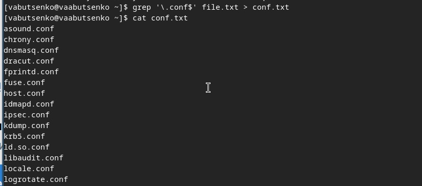
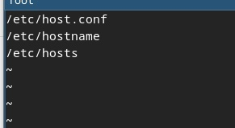
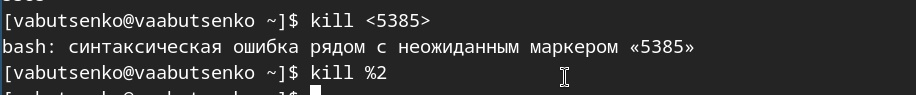

---
## Front matter
title: "Лабораторная работа №6"
subtitle: "Поиск файлов. Перенаправление ввода-вывода. Просмотр запущенных процессов"
author: "Варвара Алексеевна Буценко"

## Generic otions
lang: ru-RU
toc-title: "Содержание"

## Bibliography
bibliography: bib/cite.bib
csl: pandoc/csl/gost-r-7-0-5-2008-numeric.csl

## Pdf output format
toc: true # Table of contents
toc-depth: 2
lof: true # List of figures
lot: true # List of tables
fontsize: 12pt
linestretch: 1.5
papersize: a4
documentclass: scrreprt
## I18n polyglossia
polyglossia-lang:
  name: russian
  options:
	- spelling=modern
	- babelshorthands=true
polyglossia-otherlangs:
  name: english
## I18n babel
babel-lang: russian
babel-otherlangs: english
## Fonts
mainfont: IBM Plex Serif
romanfont: IBM Plex Serif
sansfont: IBM Plex Sans
monofont: IBM Plex Mono
mathfont: STIX Two Math
mainfontoptions: Ligatures=Common,Ligatures=TeX,Scale=0.94
romanfontoptions: Ligatures=Common,Ligatures=TeX,Scale=0.94
sansfontoptions: Ligatures=Common,Ligatures=TeX,Scale=MatchLowercase,Scale=0.94
monofontoptions: Scale=MatchLowercase,Scale=0.94,FakeStretch=0.9
mathfontoptions:
## Biblatex
biblatex: true
biblio-style: "gost-numeric"
biblatexoptions:
    - parentracker=true
    - backend=biber
    - hyperref=auto
    - language=auto
    - autolang=other*
    - citestyle=gost-numeric
## Pandoc-crossref LaTeX customization
figureTitle: "Рис."
tableTitle: "Таблица"
listingTitle: "Листинг"
lofTitle: "Список иллюстраций"
lotTitle: "Список таблиц"
lolTitle: "Листинги"
## Misc options
indent: true
header-includes:
    - \usepackage{indentfirst}
    - \usepackage{float} # keep figures where there are in the text
    - \floatplacement{figure}{H} # keep figures where there are in the text
---

# Цель работы

Ознакомление с инструментами поиска файлов и фильтрации текстовых данных.
Приобретение практических навыков: по управлению процессами (и заданиями), по проверке использования диска и обслуживанию файловых систем.

# Задание 

1. Осуществите вход в систему, используя соответствующее имя пользователя.
2. Запишите в файл file.txt названия файлов, содержащихся в каталоге /etc. Допишите в этот же файл названия файлов, содержащихся в вашем домашнем каталоге.
3. Выведите имена всех файлов из file.txt, имеющих расширение .conf, после чего запишите их в новый текстовой файл conf.txt.
4. Определите, какие файлы в вашем домашнем каталоге имеют имена, начинавшиеся с символа c? Предложите несколько вариантов, как это сделать.
5. Выведите на экран (по странично) имена файлов из каталога /etc, начинающиеся с символа h.
6. Запустите в фоновом режиме процесс, который будет записывать в файл ~/logfile файлы, имена которых начинаются с log.
7. Удалите файл ~/logfile.
8. Запустите из консоли в фоновом режиме редактор gedit.
9. Определите идентификатор процесса gedit, используя команду ps, конвейер и фильтр grep. Как ещё можно определить идентификатор процесса?
10. Прочтите справку (man) командыkill, после чего используйте её для завершения процесса gedit.
11. Выполните команды df и du, предварительно получив более подробную информацию об этих командах, с помощью команды man.
12. Воспользовавшись справкой команды find, выведите имена всех директорий, имеющихся в вашем домашнем каталоге

# Теоретическое введение

- Вся необходимая теория по лабораторной работе №5 находится в разделе курса "Операционные сестемы" по ссылке 
- https://esystem.rudn.ru/pluginfile.php/2295257/mod_resource/content/4/006-lab_proc.pdf

# Выполнение лабораторной работы

1. Осуществила вход в систему, используя соответствующее имя пользователя.

{#fig:001 width=70%}

2. Записала в файл file.txt названия файлов, содержащихся в каталоге /etc. 

{#fig:001 width=70%}

Дописала в этот же файл названия файлов, содержащихся в вашем домашнем каталоге.

{#fig:001 width=70%}

3. Вывела имена всех файлов из file.txt, имеющих расширение .conf, после чего записала их в новый текстовой файл conf.txt.

{#fig:001 width=70%}

4. Определила, какие файлы в вашем домашнем каталоге имеют имена, начинавшиеся с символа c. 

- ls ~/c*
- find ~ -name "c*"
- ls ~ | grep '^c'

{#fig:001 width=70%}

{#fig:001 width=70%}

5. Вывела на экран (по странично) имена файлов из каталога /etc, начинающиеся с символа h.

.jpg){#fig:001 width=70%}

{#fig:001 width=70%}

6. Запустила в фоновом режиме процесс, который будет записывать в файл ~/logfile файлы, имена которых начинаются с log.

{#fig:001 width=70%}

7. Удалила файл ~/logfile.

{#fig:001 width=70%}

8. Запустила из консоли в фоновом режиме редактор gedit.

{#fig:001 width=70%}

9. Определила идентификатор процесса gedit, используя команду ps, конвейер и фильтр grep. Как ещё можно определить идентификатор процесса?

- ps aux | grep gedit
- pgrep gedit

{#fig:001 width=70%}

10. Прочитала справку (man) команды kill, после чего использовала её для завершения процесса gedit.

{#fig:001 width=70%}

{#fig:001 width=70%}

11. Выполнила команды df и du, предварительно получив более подробную информацию об этих командах, с помощью команды man.

{#fig:001 width=70%}

{#fig:001 width=70%}

12. Воспользовавшись справкой команды find, вывела имена всех директорий, имеющихся в вашем домашнем каталоге

{#fig:001 width=70%}

# Контрольные вопросы

1. Какие потоки ввода-вывода вы знаете?
- В Linux и Unix-подобных системах существуют стандартные потоки ввода-вывода:
- Стандартный ввод (stdin): обычно связан с клавиатурой.
- Стандартный вывод (stdout): обычно связан с экраном (консолью).
- Стандартный вывод ошибок (stderr): также связан с экраном и используется для вывода сообщений об ошибках.

2. Объясните разницу между операцией > и >>.

1) >: используется для перенаправления вывода команды в файл. Если файл уже существует, он будет перезаписан.

- echo "hello" > file.txt (при существовании)
- Запишет "hello" в file.txt, перезаписав его 

2) >>: используется для добавления вывода команды в конец файла. Если файл не существует, он будет создан.

-echo "world" >> file.txt
-file.txt. (Добавит "world" в конец уже существующего)

3. Что такое конвейер?

- Конвейер (pipeline) — это механизм, который позволяет передавать вывод одной команды как ввод для другой команды, обычно с помощью оператора |.

- Например:
- ls | grep ".txt" (Переводит выход команды ls в качестве ввода для grep).

4. Что такое процесс? Чем это понятие отличается от программы?

- Процесс — это экземпляр программы, который выполняется в операционной системе. Он имеет свое состояние, включая данные, указатели выполнения и ресурсы.

- Программа — это статический набор инструкций и данных, хранящихся на диске. 

- Процесс — это динамическое выполнение программы. При запуске программы создается процесс.

5. Что такое PID и GID?

- PID (Process ID) — это уникальный идентификатор процесса, присвоенный ему системой при создании.
- GID (Group ID) — это идентификатор группы, которому принадлежит процесс. Он используется для управления правами доступа и групповой активностью процессов.

6. Что такое задачи и какая команда позволяет ими управлять?

- Задачи (jobs) — это процессы, выполняемые в фоне или в переднем плане. Для управления такими задачами можно использовать следующие команды:

- jobs — показывает список текущих задач.
- fg %<номер> — переводит задачу в передний план.
- bg %<номер> — переводит задачу в фон.
- kill <PID> — завершает процесс.

7. Найдите информацию об утилитах top и htop. Каковы их функции?

- top: это утилита, показывающая динамическое отображение активных процессов, памяти и загрузки CPU в режиме реального времени.
- htop: это улучшенная версия top, предоставляющая более интуитивно понятный интерфейс с возможностью управления процессами, сортировки и фильтрации.

8. Назовите и дайте характеристику команде поиска файлов. Приведите примеры использования этой команды.

- find: команда для поиска файлов и каталогов по определенным критериям.

- Примеры:
- find /path/to/search -name "*.txt" (Ищет все текстовые файлы).
- find ~ -type d -name "Documents" (Ищет директорию с именем "Documents" в домашнем каталоге).

9. Можно ли по контексту (содержанию) найти файл? Если да, то как?

- Да, можно использовать команду grep для поиска по содержимому файлов.

- Например:
- grep -r "search_term" /path/to/search (Ищет "search_term" во всех файлах в данном каталоге).

10. Как определить объем свободной памяти на жёстком диске?

- Для проверки свободного пространства на жестком диске используйте команду:
- df -h (Отображает использование диска с понятными размерами).

11. Как определить объем вашего домашнего каталога?

- Чтобы узнать размер вашего домашнего каталога, используйте команду:
-du -sh ~ (Показывает общий размер домашнего каталога).

12. Как удалить зависший процесс?

- Чтобы удалить зависший процесс, найдите его PID с помощью команды ps или top, а затем выполните команду:
- kill <PID> (Завершает процесс).
- Если процесс не завершен:
- kill -9 <PID> (Убивает процесс принудительно).

# Список литературы{.unnumbered}

1. Dash, P. Getting Started with Oracle VM VirtualBox / P. Dash. – Packt Publishing Ltd, 2013. –
86 сс.
2. Colvin, H. VirtualBox: An Ultimate Guide Book on Virtualization with VirtualBox. VirtualBox /
H. Colvin. – CreateSpace Independent Publishing Platform, 2015. – 70 сс.
3. Vugt, S. van. Red Hat RHCSA/RHCE 7 cert guide : Red Hat Enterprise Linux 7 (EX200 and
EX300) : Certification Guide. Red Hat RHCSA/RHCE 7 cert guide / S. van Vugt. – Pearson IT
Certification, 2016. – 1008 сс.
4. Робачевский, А. Операционная система UNIX / А. Робачевский, С. Немнюгин, О. Стесик.
– 2-е изд. – Санкт-Петербург : БХВ-Петербург, 2010. – 656 сс.
5. Немет, Э. Unix и Linux: руководство системного администратора. Unix и Linux / Э. Немет,
Г. Снайдер, Т.Р. Хейн, Б. Уэйли. – 4-е изд. – Вильямс, 2014. – 1312 сс.
6. Колисниченко, Д.Н. Самоучитель системного администратора Linux : Системный
администратор / Д.Н. Колисниченко. – Санкт-Петербург : БХВ-Петербург, 2011. – 544 сс.
7. Robbins, A. Bash Pocket Reference / A. Robbins. – O’Reilly Media, 2016. – 156 сс.

